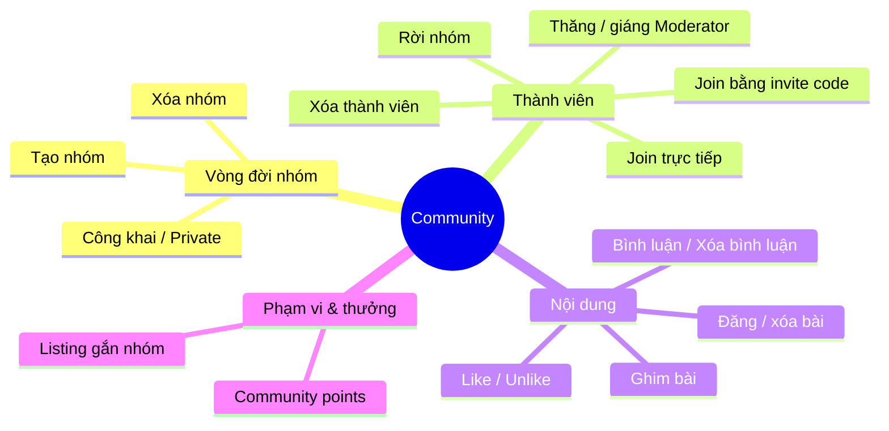
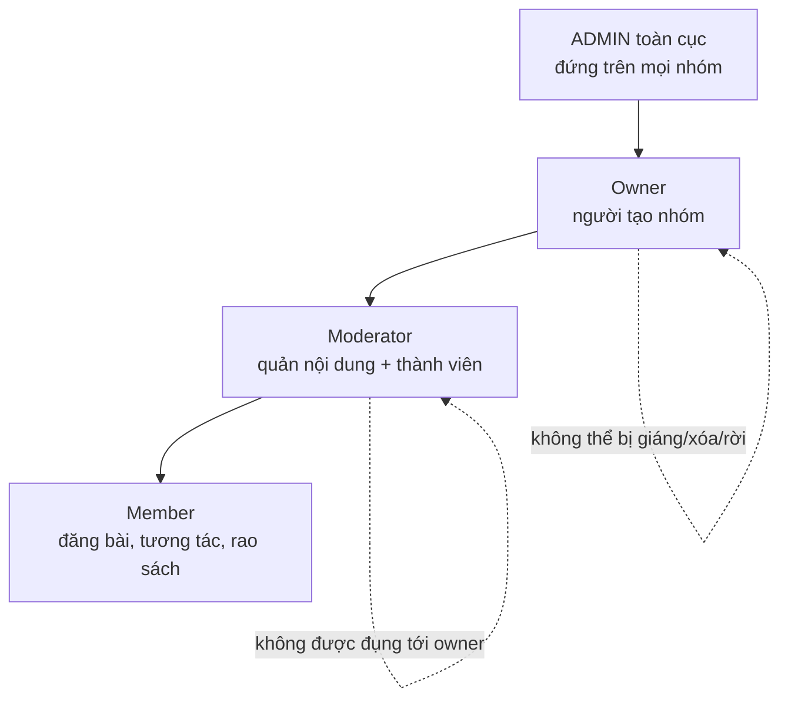
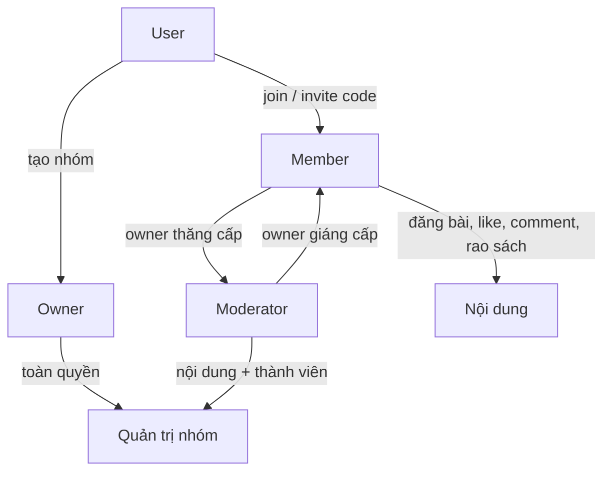
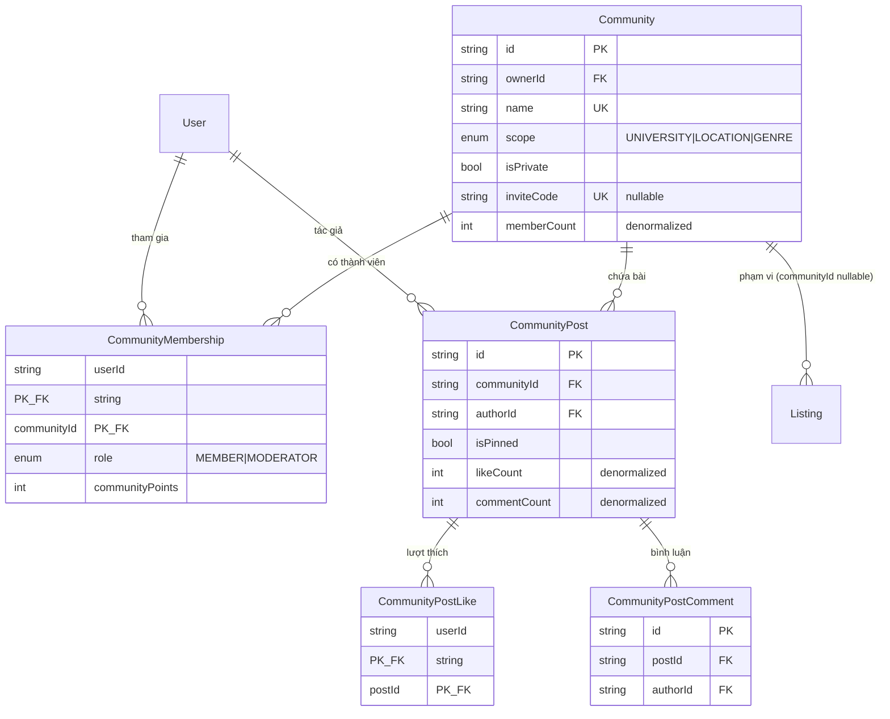
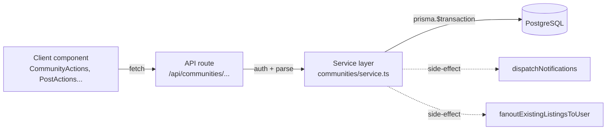
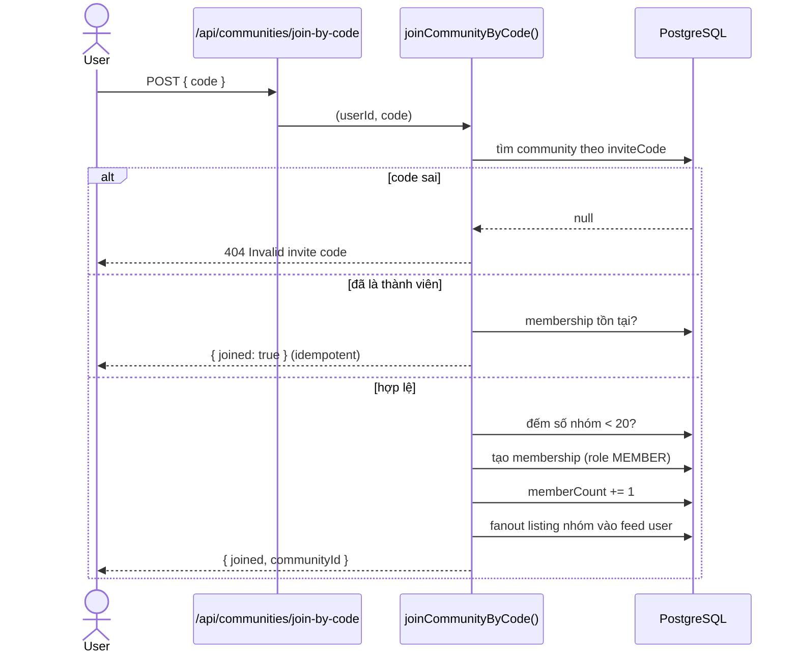
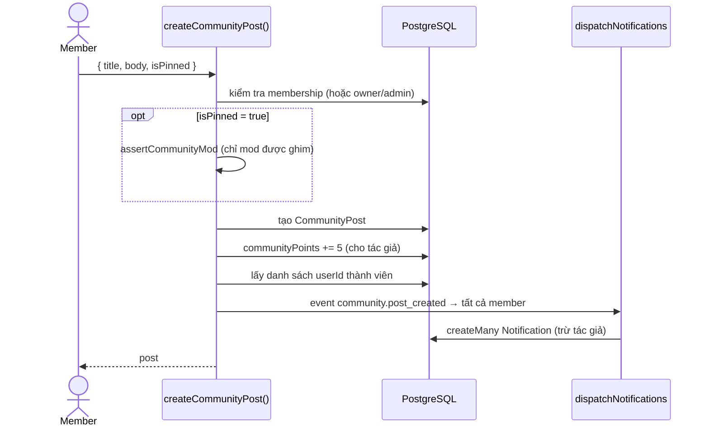

# Community — Tài liệu tính năng & backend

## 1. Tính năng (top-down)
Community là các **nhóm con** (theo trường / khu vực / thể loại) nơi thành viên đăng bài, tương tác, và rao sách trong phạm vi nhóm. Mọi tính năng xoay quanh 4 trục:

Community là các nhóm con (theo trường / khu vực / thể loại) nơi thành viên đăng bài, tương tác, và rao sách trong phạm vi nhóm.

| Nhóm tính năng | Mô tả | Ai được làm |
|---|---|---|
| **Tạo / xóa community** | Lập nhóm mới (UNIVERSITY/LOCATION/GENRE), công khai hoặc private | Tạo: user bất kỳ · Xóa: owner hoặc ADMIN |
| **Tham gia** | Join trực tiếp (public) hoặc bằng invite code (private).| User |
| **Rời nhóm** | Rời community (owner không thể rời) | Member |
| **Bài viết (Post)** | Tạo / xóa bài, ghim (pin) bài | Tạo: member · Xóa: tác giả hoặc mod · Ghim: mod |
| **Tương tác** | Like / bỏ like, bình luận, xóa bình luận | Like+comment: member · Xóa comment: tác giả hoặc mod |
| **Listing trong nhóm** | Sách rao gắn `communityId` hiện trong nhóm; gỡ listing | Thêm: member (qua trang tạo listing) · Gỡ: chủ listing hoặc mod |
| **Quản trị thành viên** | Thăng/giáng MODERATOR, xóa thành viên, tạo lại invite code | Owner/ADMIN (mod có thể xóa member) |
| **Community points** | Điểm tích lũy theo hoạt động: +5 đăng bài, +3 bình luận, +2 like | Tự động |

### Phân quyền (3 cấp)

- **Owner** — người tạo nhóm; toàn quyền, không thể bị giáng/xóa/rời.
- **Moderator** — quản lý nội dung & thành viên (trừ đụng tới owner).
- **Member** — đăng bài, tương tác, rao sách.
- *(ADMIN toàn cục đứng trên tất cả.)*

**Ai làm được gì:**

| Hành động | Member | Moderator | Owner | ADMIN |
|---|:---:|:---:|:---:|:---:|
| Đăng bài, like, bình luận, rao sách | ✅ | ✅ | ✅ | ✅ |
| Xóa bài / bình luận của **chính mình** | ✅ | ✅ | ✅ | ✅ |
| Ghim bài | ❌ | ✅ | ✅ | ✅ |
| Xóa bài / bình luận của **người khác** | ❌ | ✅ | ✅ | ✅ |
| Xóa thành viên | ❌ | ✅ | ✅ | ✅ |
| Thăng / giáng Moderator | ❌ | ❌ | ✅ | ✅ |
| Tạo lại invite code | ❌ | ✅ | ✅ | ✅ |
| Xóa nhóm | ❌ | ❌ | ✅ | ✅ |

> Quy tắc bất biến: **Owner không thể bị giáng, xóa, hay tự rời nhóm.** Moderator quản được nội dung và thành viên thường, nhưng chạm tới owner thì bị chặn. Việc thăng/giáng mod là đặc quyền riêng của owner (và ADMIN).

## 2. Mô hình dữ liệu

**Điểm thiết kế cần nhớ:**
- `CommunityMembership` dùng **khóa chính kép** `(userId, communityId)` → mỗi user chỉ có 1 membership/nhóm; role nằm trên bảng này.
- `memberCount`, `likeCount`, `commentCount` là **denormalized**, phải cập nhật thủ công trong cùng transaction mỗi khi thêm/bớt (xem flow bên dưới).
- `Listing.communityId` **nullable**: `NULL` = listing toàn cục; có giá trị = chỉ thuộc nhóm đó. `onDelete: SetNull` → xóa nhóm thì listing trở thành toàn cục, không mất.
- Quan hệ con (`onDelete: Cascade`): xóa community/post tự động dọn membership, post, like, comment.

## 3. Kiến trúc backend

3 lớp, tách bạch rõ:

- **API route** (`src/app/api/communities/**`): xác thực qua iron-session, parse body bằng Zod, gọi service, map lỗi → HTTP status.
- **Service** (`src/server/communities/service.ts`): toàn bộ business logic. Mọi thao tác ghi đều bọc trong `prisma.$transaction` để đảm bảo tính nguyên tử (ghi dữ liệu + cập nhật bộ đếm + bắn notification cùng lúc, hoặc rollback hết).
- **Phân quyền** tập trung ở helper `assertCommunityMod(actor, community, membership)` — kiểm tra mod/owner/admin, ném `ForbiddenError` nếu không đủ quyền.

### Flow 1 — Tham gia bằng invite code

### Flow 2: Đăng bài (kèm điểm + notification)

Đây là flow điển hình cho thấy 3 việc xảy ra **trong cùng 1 transaction**:

### Quyền xóa bài / xóa listing (tính năng bổ sung gần đây)
- **Xóa post** (`deleteCommunityPost`): cho phép nếu `isAuthor || isMod` (mod = MODERATOR của nhóm, owner, hoặc ADMIN).
- **Xóa comment** (`deleteComment`): cùng quy tắc `isAuthor || isMod`, kèm `commentCount -= 1`.
- **Gỡ listing** (`listings/service.ts → deleteListing`): cho phép nếu là chủ listing, ADMIN, owner nhóm, hoặc MODERATOR nhóm; đặt status `REMOVED` và hủy các transaction PENDING.

### Bộ đếm denormalized
Mỗi thao tác thay đổi quan hệ con phải sửa bộ đếm tương ứng **trong cùng transaction**:

| Thao tác | Ghi quan hệ | Cập nhật đếm |
|---|---|---|
| join / leave / remove member | `CommunityMembership` ± | `memberCount` ± 1 |
| like / unlike | `CommunityPostLike` ± | `likeCount` ± 1, `communityPoints` ± 2 |
| comment / xóa comment | `CommunityPostComment` ± | `commentCount` ± 1, `communityPoints` + 3 |
| đăng bài | `CommunityPost` + | `communityPoints` + 5 |

> Vì bộ đếm là denormalized, nếu một thao tác ghi quan hệ mà quên cập nhật đếm (hoặc làm ngoài transaction) thì số liệu sẽ lệch. Đây là điểm dễ sinh bug nhất của module này.
