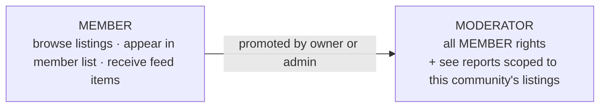
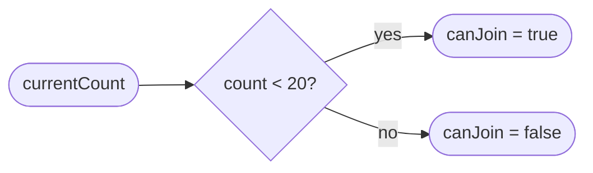
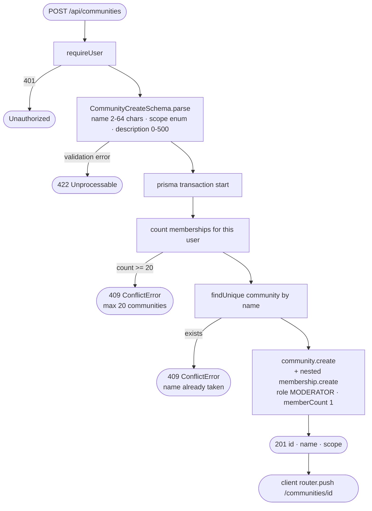
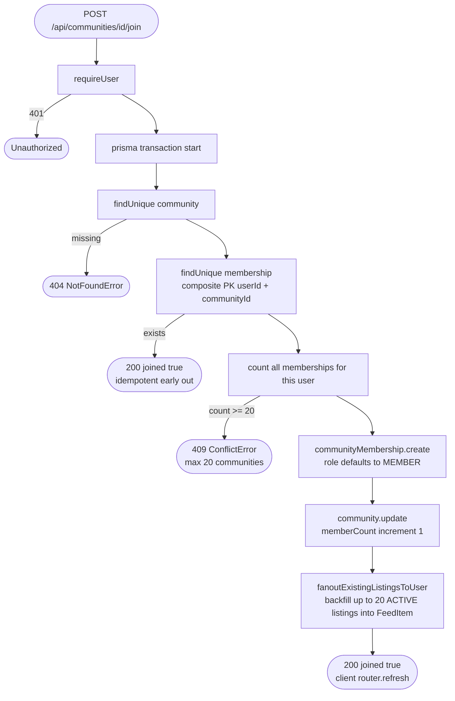
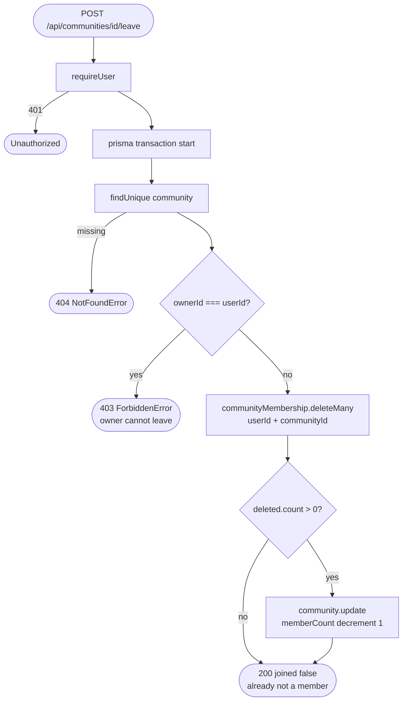
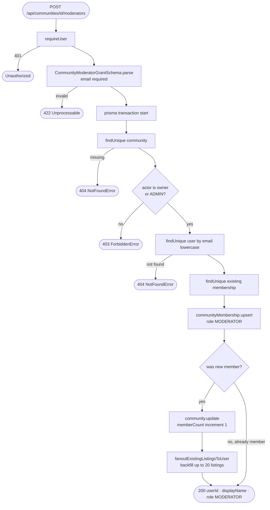
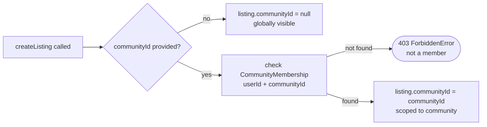
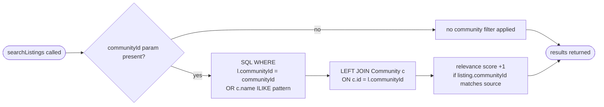
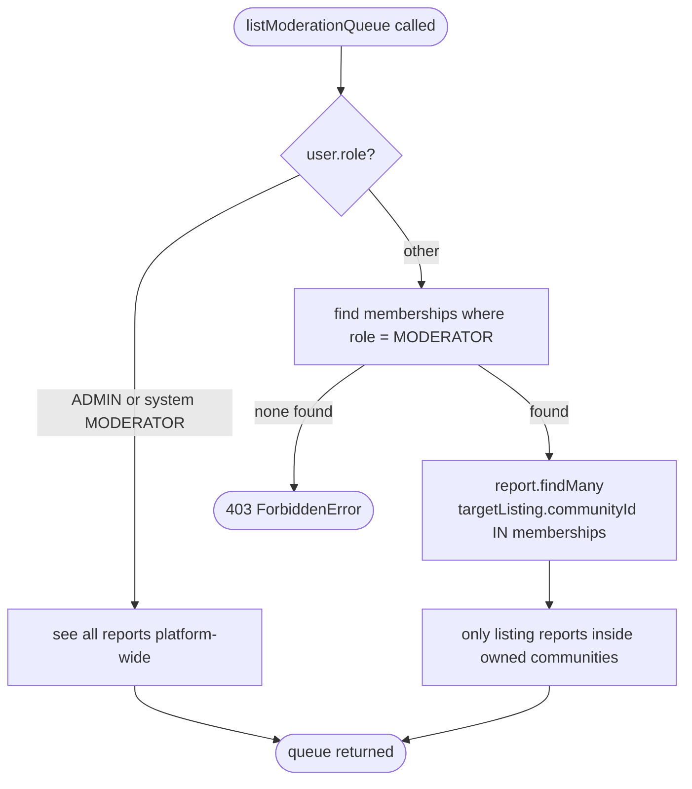
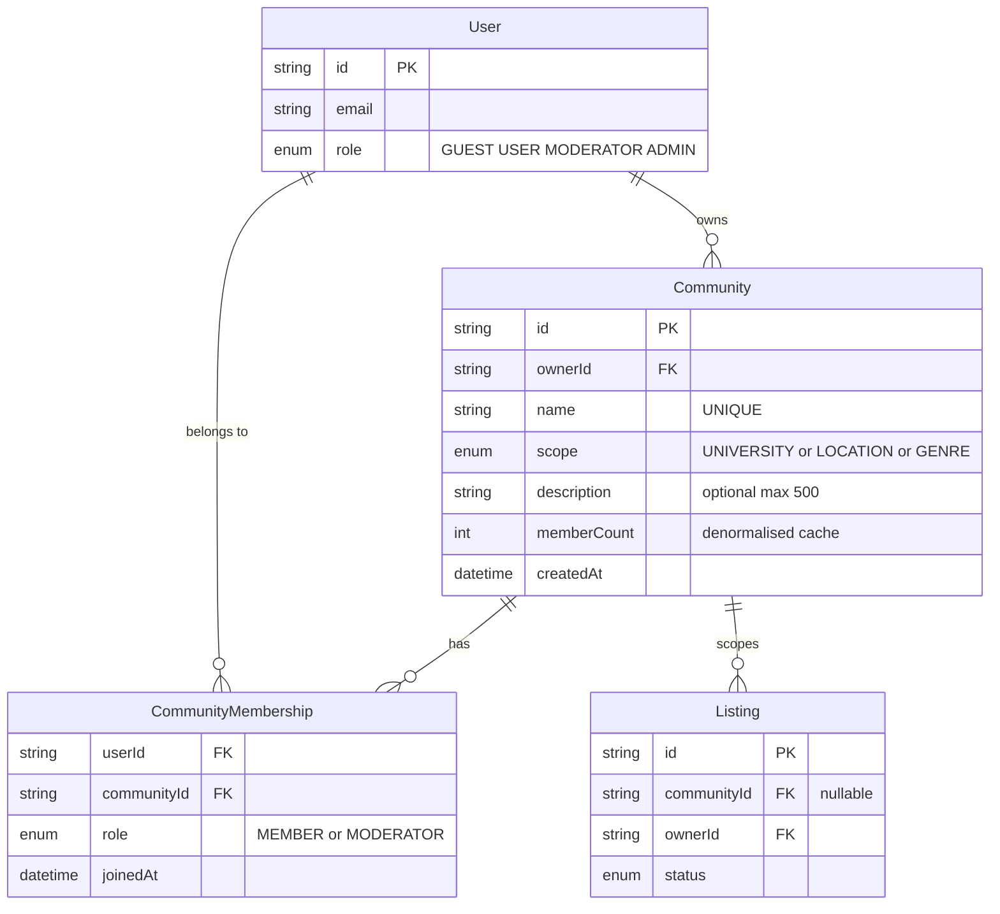

# Community System — Deep Dive

BookBridge communities are scoped groups that connect users around a shared
context (a university, a city district, or a book genre). A community is not
just a label — it gates feed delivery, search filtering, moderation scope, and
listing visibility all at once.

---

## 1. What a community actually is

A community has five things:

| Field | Purpose |
|---|---|
| `name` (unique) | Human identifier. Globally unique — no two communities can share a name. |
| `scope` | One of `UNIVERSITY`, `LOCATION`, or `GENRE`. Scope is a classification, not an enforcement boundary. |
| `description` | Optional free text, max 500 chars. |
| `ownerId` | The user who created it. The owner is permanently attached — they cannot leave. |
| `memberCount` | Denormalised integer. Updated with `increment`/`decrement` on every join/leave inside the same Prisma transaction that touches the membership row. |

The membership table is the source of truth. `memberCount` on the community row
is a cache for fast display — it is never derived at query time.

---

## 2. Roles inside a community

There are exactly two roles: `MEMBER` and `MODERATOR`.



The creator of a community is always created as `MODERATOR`, not `MEMBER`. That
distinction matters for the moderation queue (see section 7).

A system-level `MODERATOR` role on the `User` model is separate. A user with
`User.role = MODERATOR` sees all reports platform-wide. A user who is a
community moderator only via `CommunityMembership.role = MODERATOR` sees only
reports targeting listings inside that community.

---

## 3. The 20-community cap



The cap is checked in two places:

1. `createCommunity` — counts existing memberships for the creator before creating
2. `joinCommunity` — counts existing memberships for the joiner before inserting

Both checks run inside a `prisma.$transaction` block so the count and the
insert are atomic. Without the transaction, two concurrent join requests for the
same user could both read count 19, both pass the guard, and insert two rows,
landing the user at 21.

The constant `MAX_COMMUNITIES_PER_USER = 20` is exported so tests can import
it directly instead of hardcoding the number.

---

## 4. Create flow



The membership and the community are created in a single nested write, not two
separate calls. This is important — it guarantees the community never exists
without at least one member (the creator), and the creator is never a plain
`MEMBER` of their own community.

---

## 5. Join flow



The idempotency check at step 2 is deliberate. If the user double-clicks Join
or retries a failed request, the second call finds the existing membership and
returns success immediately without touching any counter or creating any feed
items. This prevents `memberCount` from drifting above the real number of rows.

Step 6 (fanout) is the most consequential side effect: joining a community
retroactively populates the user's feed with that community's existing listings,
capped at 20, ordered newest first. The user sees context immediately rather
than an empty feed.

---

## 6. Leave flow



`deleteMany` is used instead of `delete` so that if the membership row does not
exist (user already left, or never joined), the operation succeeds silently and
the counter is not decremented. Using `delete` would throw a Prisma
`P2025 Record to delete does not exist` error.

The owner block is a hard constraint enforced only at the service layer. The UI
disables the Leave button when `isOwner === true`, but the server re-checks
regardless.

There is no cascade on leaving: the user's `FeedItem` rows tied to that
community's listings are not deleted. The user keeps seeing those items in
their current feed session; they simply stop receiving new ones.

---

## 7. Moderator grant flow



The upsert is the key design decision here. If the target is already a member,
their role is upgraded to `MODERATOR` and the count is not touched (they were
already counted). If they were not a member, they are created as a `MODERATOR`
directly — they skip the `MEMBER` state entirely — and the count is incremented
and the fanout runs just as it would for a normal join.

This means the 20-community cap is NOT checked during a moderator grant. The
assumption is that the owner or admin who is granting the role has authority to
add someone regardless of their current count. This is a deliberate product
decision: the cap exists to prevent spam-joining, not to block an owner from
building their moderation team.

---

## 8. How communities connect to listings

When a listing is created, the creator can optionally attach it to a community
they are a member of. The service enforces this:



A listing's `communityId` is nullable. `null` means globally visible. A set
`communityId` means the listing appears in that community's listing grid and
is used as a filter signal in search.

---

## 9. How communities connect to the feed

There are two moments when community membership produces feed items.

### On join (retroactive backfill)

```
joinCommunity()
  └── fanoutExistingListingsToUser(tx, userId, { communityId })
        └── listing.findMany { status: ACTIVE, communityId: ... } take: 20
        └── feedItem.createMany skipDuplicates: true
```

The user immediately sees up to 20 existing listings from the community in
their feed. `skipDuplicates: true` means if the user already has a feed item
for a listing (because they also follow the owner), it is not duplicated.

### On listing create (forward fanout)

```
listings/fanout.ts → emitListingCreated()
  ├── follow.findMany { followeeId: listing.ownerId }
  └── communityMembership.findMany { communityId: listing.communityId }
       (only if listing has a communityId)
  └── buildListingCreatedFanout()
        ├── builds FeedItem rows for followers + community members
        │   reasons array: ["followed_owner"] or ["community"] or both
        └── builds Notification rows via notificationTargets()
  └── feedItem.createMany + notification.createMany
```

A user who both follows the listing owner and is a member of the listing's
community gets one feed item, not two. The deduplication is in
`buildListingCreatedFanout` via the `feedRecipients` Map — the same userId
key accumulates both reasons `["followed_owner", "community"]` in a single row.

The listing owner is excluded from their own fanout in both directions
(`if (followerId !== listing.ownerId)` and `if (userId !== listing.ownerId)`).

---

## 10. How communities connect to search



The search query joins the Community table so a user can filter by community
name (text) or community id (exact). Related listings on a detail page are
ranked higher if they share the same `communityId` as the source listing — the
relevance scoring adds +1 to the score for same-community matches.

---

## 11. How communities connect to moderation

The moderation queue is scoped by community role:



A community moderator sees only reports where the reported listing belongs to
one of their communities. Reports against users, transactions, or messages
directly are invisible to community moderators — those require system-level
`MODERATOR` or `ADMIN` role. This is a deliberate scope boundary: community
moderators curate their space, not the whole platform.

`hasModerationAccess` and `canModerateReport` are the two guard functions used
before showing the moderation UI and before executing a moderation action
respectively.

---

## 12. The UI layer

### `/communities` page (server component)

Reads `searchParams` for `q` and `scope`. Calls `listCommunities` server-side.
Renders a filter form and a list of community cards as `<Link>` elements. The
`CommunityCreateForm` is only rendered when `user !== null`.

### `/communities/[id]` page (server component)

Calls `getCommunity(id, user?.id)`. The response includes:
- community metadata
- up to 50 memberships (oldest first)
- up to 20 active listings (newest first, with first photo)
- `myMembership` — the current user's membership row or null

`canGrantModerator` is derived inline: `user && (ownerId === user.id || user.role === ADMIN)`.

### `CommunityActions` (client component)

Single component for join and leave. Uses a shared `act("join" | "leave")` function
that hits the appropriate API route. Disables itself while the request is in flight.
The Leave button is disabled (not hidden) when `isOwner === true` — the UI shows
"Owner" as the label so the user understands why they cannot leave.

### `CommunityCreateForm` (client component)

Collects `name`, `scope` (dropdown defaulting to UNIVERSITY), and optional
`description`. On success, redirects to the new community page via
`router.push`. On conflict (name taken), shows the server error inline.

### `CommunityModeratorForm` (client component)

Takes an email input. Only rendered when `canGrantModerator === true`. On
success, shows a confirmation message with the promoted user's display name
and clears the input. Does not navigate — the membership list refreshes in
place via `router.refresh()`.

---

## 13. Data model summary



The composite primary key on `CommunityMembership` is what makes the join
idempotency check and the upsert in moderator grant both safe. There is no way
for a user to have two membership rows in the same community.

---

## 14. What is missing and why

The builders made deliberate choices to leave certain things out of scope:

**No community deletion.** There is no `DELETE /api/communities/[id]` route and
no `deleteCommunity` function. The owner can mark their own listings unavailable
but cannot dissolve the community. This avoids the complexity of cascading
member notifications and orphaned listing references.

**No moderator demotion.** `grantCommunityModerator` promotes to `MODERATOR`
but there is no `revokeCommunityModerator`. Once granted, the role can only
be changed directly in the database or by a future feature.

**No leave cascade on feed.** When a user leaves, their `FeedItem` rows for
that community's listings stay. The team accepted eventual staleness over
the cost of a bulk delete on leave.

**No community-to-community relationships.** There is no nesting, no parent
community, no federation between communities. Each is a flat group.

**No private communities.** All communities and their listings are visible to
all users, including guests. The `scope` field is a classification for search
filtering, not an access gate.
