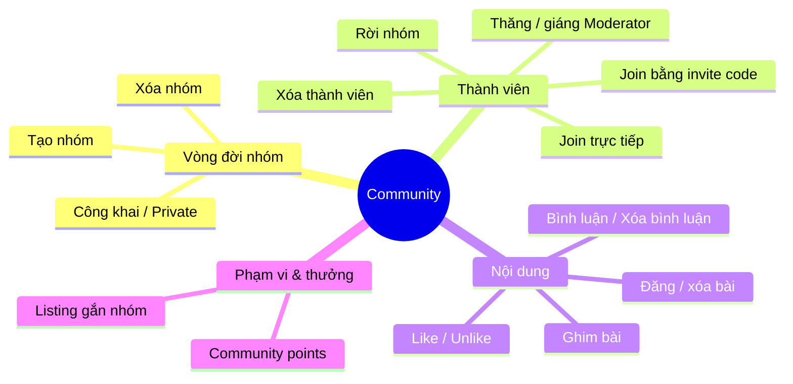
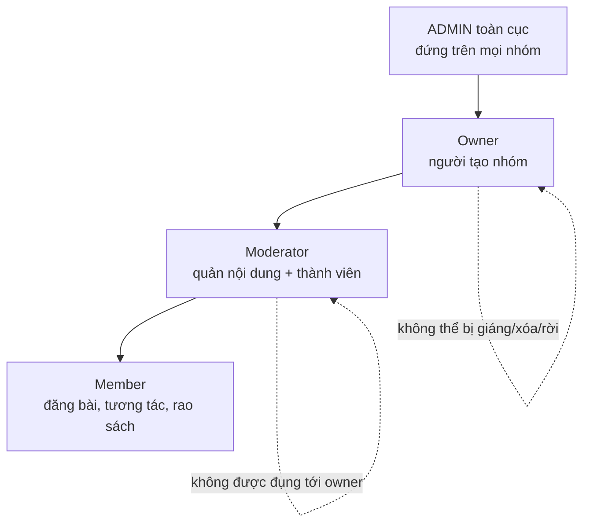
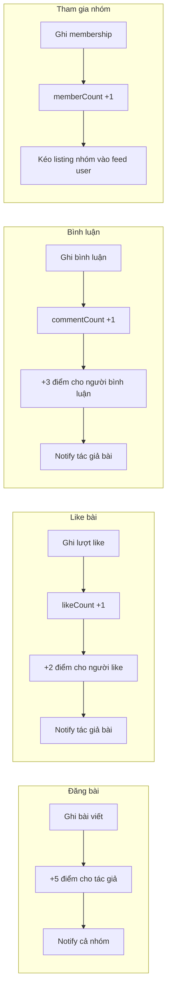
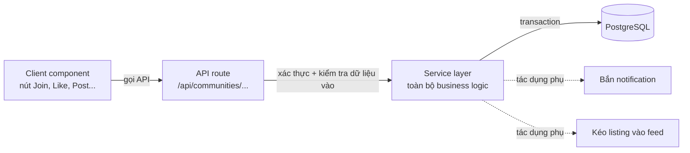
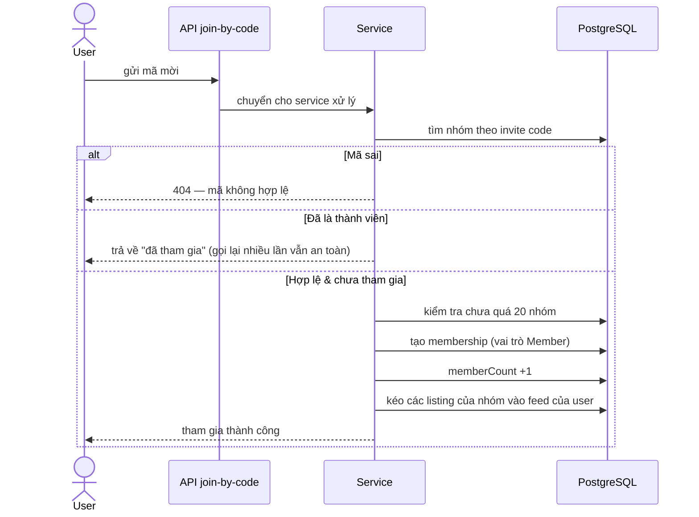
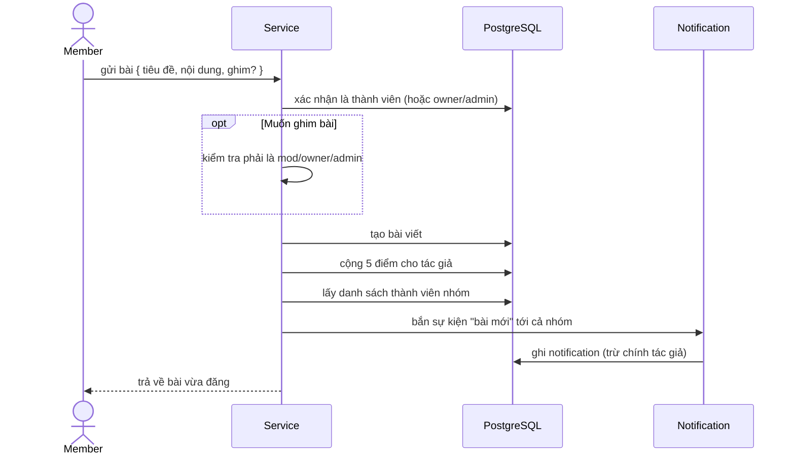
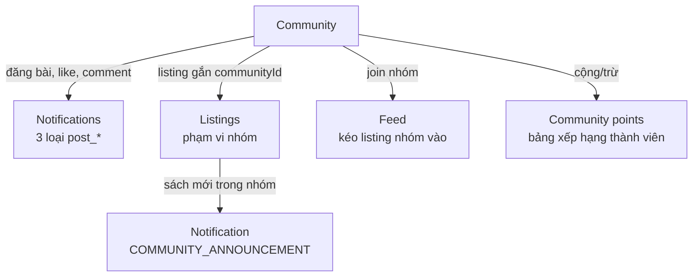

# Community — Bản đồ luồng (v2, high-level)

> Tài liệu này nhìn module Community ở góc **"ai làm được gì → hành động chạm vào đâu → kéo theo hệ quả nào"**, không đi vào code. Trọng tâm: phân quyền theo cấp, các flow tương tác, và vì sao mỗi tương tác lại đụng tới nhiều phần khác (điểm, bộ đếm, notification, feed).

---

## 1. Community là gì — và 4 trục tính năng

Community là các **nhóm con** (theo trường / khu vực / thể loại) nơi thành viên đăng bài, tương tác, và rao sách trong phạm vi nhóm. Mọi tính năng xoay quanh 4 trục:

---

## 2. Phân quyền — 4 cấp, ai đứng trên ai

Đây là xương sống của toàn module. Mọi hành động ghi đều kiểm tra cấp bậc trước.

**Ai làm được gì:**

| Hành động | Member | Moderator | Owner | ADMIN |
|---|:---:|:---:|:---:|:---:|
| Đăng bài, like, bình luận, rao sách | ✅ | ✅ | ✅ | ✅ |
| Xóa bài / bình luận của **chính mình** | ✅ | ✅ | ✅ | ✅ |
| Ghim bài | ❌ | ✅ | ✅ | ✅ |
| Xóa bài / bình luận của **người khác** | ❌ | ✅ | ✅ | ✅ |
| Xóa thành viên | ❌ | ✅ | ✅ | ✅ |
| Thăng / giáng Moderator | ❌ | ❌ | ✅ | ✅ |
| Tạo lại invite code | ❌ | ✅ | ✅ | ✅ |
| Xóa nhóm | ❌ | ❌ | ✅ | ✅ |

> Quy tắc bất biến: **Owner không thể bị giáng, xóa, hay tự rời nhóm.** Moderator quản được nội dung và thành viên thường, nhưng chạm tới owner thì bị chặn. Việc thăng/giáng mod là đặc quyền riêng của owner (và ADMIN).

---

## 3. Mỗi tương tác chạm vào nhiều phần — đây là điểm cốt lõi

Điều khiến module này phức tạp hơn vẻ ngoài: **một hành động đơn giản kéo theo 2–4 hệ quả**, và tất cả phải xảy ra cùng lúc (cùng một transaction) — hoặc rollback hết.

**Bảng "một chạm → nhiều hệ quả":**

| Tương tác | Ghi quan hệ | Bộ đếm | Điểm | Notification | Hệ quả khác |
|---|---|---|---|---|---|
| Đăng bài | `CommunityPost` + | — | +5 tác giả | → cả nhóm | — |
| Like | `CommunityPostLike` + | `likeCount` +1 | +2 người like | → tác giả | — |
| Unlike | `CommunityPostLike` − | `likeCount` −1 | −2 người like | (không) | — |
| Bình luận | `CommunityPostComment` + | `commentCount` +1 | +3 người bình luận | → tác giả | — |
| Xóa bình luận | `CommunityPostComment` − | `commentCount` −1 | — | (không) | — |
| Join / rời / bị xóa | `CommunityMembership` ± | `memberCount` ±1 | — | (không) | Kéo listing nhóm vào feed (khi join) |

> **Đây là chỗ dễ sinh bug nhất.** Các bộ đếm (`memberCount`, `likeCount`, `commentCount`) là **denormalized** — lưu sẵn con số thay vì đếm lại mỗi lần. Lợi: đọc nhanh. Hại: mỗi khi thêm/bớt quan hệ con mà **quên cập nhật đếm** (hoặc làm ngoài transaction), số liệu sẽ lệch vĩnh viễn. Nguyên tắc: ghi quan hệ và sửa đếm luôn đi đôi, trong cùng một transaction.

---

## 4. Kiến trúc 3 lớp

- **API route**: cổng vào — xác thực phiên đăng nhập, kiểm tra dữ liệu, gọi service, dịch lỗi thành mã HTTP.
- **Service**: nơi chứa *toàn bộ* luật nghiệp vụ. Mọi thao tác ghi đều bọc trong một transaction để cả cụm "ghi dữ liệu + cập nhật đếm + cộng điểm + bắn notify" thành nguyên tử.
- **Phân quyền tập trung**: việc kiểm tra "có phải mod/owner/admin không" gom về một chỗ dùng chung, không rải rác mỗi nơi một kiểu.

---

## 5. Flow tiêu biểu — đọc kỹ 2 cái này là hiểu cả module

### Flow A — Tham gia bằng invite code (private community)

**Vì sao kéo listing vào feed?** Để người vừa join thấy ngay các sách đang rao trong nhóm — không phải đợi có listing mới. Đây là cầu nối giữa Community và hệ thống Feed/Listings.

### Flow B — Đăng bài (kèm điểm + báo cả nhóm)

> Cả khối trên nằm trong **một transaction**: nếu bất kỳ bước nào hỏng (vd. ghi notification lỗi), thì bài viết và điểm cộng cũng bị hủy theo. Người dùng không bao giờ thấy "bài đã đăng nhưng điểm không cộng" hay "có notify nhưng bài không tồn tại".

---

## 6. Quan hệ với phần còn lại của hệ thống

Community không phải ốc đảo — nó móc vào 3 hệ thống khác:

- **→ Notifications**: 3 loại `COMMUNITY_POST_*` sinh từ tương tác bài viết. *(Xem chi tiết ở `Notifications_v2.md`.)*
- **→ Listings**: sách có thể gắn `communityId` để chỉ hiện trong nhóm. Nếu xóa nhóm, listing **không mất** — nó trở thành listing toàn cục (thiết kế "set null", bảo toàn dữ liệu người dùng).
- **→ Feed**: join nhóm sẽ kéo listing của nhóm vào feed cá nhân.
- **→ Community points**: điểm tích lũy từ đăng bài (+5), bình luận (+3), like (+2) — làm nền cho bảng xếp hạng thành viên tích cực.

---

## 7. Tóm tắt nguyên tắc cốt lõi

1. **4 cấp quyền rõ ràng**: ADMIN > Owner > Moderator > Member; owner bất khả xâm phạm, thăng/giáng mod là đặc quyền của owner.
2. **Một chạm, nhiều hệ quả**: mỗi tương tác kéo theo ghi quan hệ + cập nhật đếm + cộng điểm + (đôi khi) notify — tất cả nguyên tử.
3. **Bộ đếm denormalized là điểm yếu**: ghi quan hệ và sửa đếm phải luôn đi đôi, trong cùng transaction.
4. **Idempotent ở chỗ cần**: join lại nhóm đã ở trong không gây lỗi hay nhân đôi.
5. **Móc nối, không cô lập**: Community đan với Notifications, Listings, Feed, và hệ điểm — hiểu một flow phải thấy cả các tác dụng phụ lan sang module khác.
