# BookBridge — Thiết kế Database & Phân công theo Use Case

> Tài liệu top-down: bắt đầu từ **một sơ đồ tổng thể**, rồi bổ ra thành **6 cụm sở hữu** (mỗi người 1 module), kèm use case và điểm chạm chéo (cross-module FK) để chia việc rõ ràng.

---

## 0. Tầm nhìn tổng thể — "Một bảng to" trước khi chia

Toàn hệ thống xoay quanh **`User`** ở trung tâm. Mọi entity khác đều bắt nguồn (trực tiếp hoặc gián tiếp) từ User: user đăng sách → sách sinh giao dịch → giao dịch sinh hội thoại, đánh giá, uy tín → song song có mạng xã hội (follow/feed), nhóm (community), kiểm duyệt (report), và thông báo gom tất cả lại.

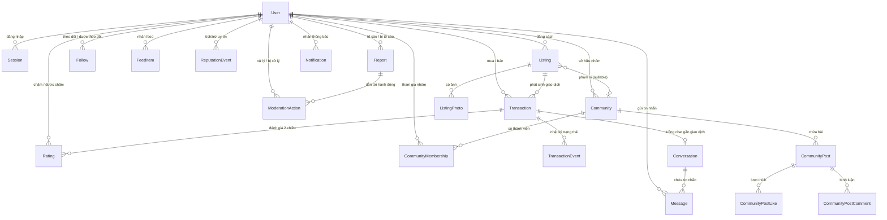

**18 entity, gom thành 6 cụm sở hữu:**

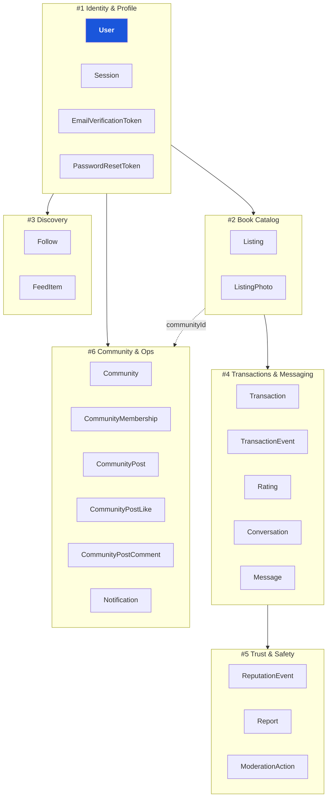

| # | Module | Bảng sở hữu | Use case chính | Enum sở hữu |
|---|---|---|---|---|
| **1** | **Identity & Profile** | User, Session, EmailVerificationToken, PasswordResetToken | Đăng ký, xác thực email, đăng nhập/session, hồ sơ, đổi mật khẩu | `UserRole`, `AccountStatus` |
| **2** | **Book Catalog** | Listing, ListingPhoto | CRUD listing, upload ảnh, tra ISBN, trần giá | `BookCondition`, `TransactionType`, `ListingStatus` |
| **3** | **Discovery** | Follow, FeedItem | Tìm full-text, follow/unfollow, feed cá nhân hóa | — |
| **4** | **Transactions & Messaging** | Transaction, TransactionEvent, Rating, Conversation, Message | Máy trạng thái giao dịch, đánh giá 2 chiều, chat realtime | `TransactionStatus`, `DeliveryMethod` |
| **5** | **Trust & Safety** | ReputationEvent, Report, ModerationAction | Engine uy tín, tố cáo, hàng đợi kiểm duyệt | `ReputationKind`, `ReportTargetType`, `ReportStatus`, `ModerationActionKind` |
| **6** | **Community & Ops** | Community, CommunityMembership, CommunityPost, CommunityPostLike, CommunityPostComment, Notification | Nhóm con, bài viết/like/comment, thông báo, email digest | `CommunityScope`, `CommunityRole`, `NotificationKind`, `NotificationEmailPreference` |

---

## 1. Identity & Profile (#1) — *gốc của mọi thứ*

`User` là hub. Mọi FK của hệ thống cuối cùng đều trỏ về đây. Người #1 sở hữu vòng đời tài khoản và là người **không bao giờ được đổi `User.id`**.

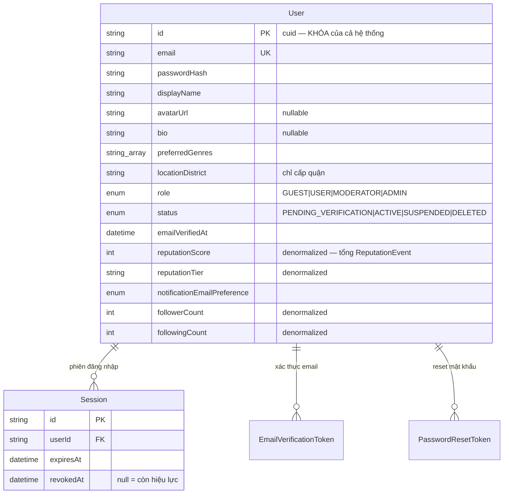

**Use case → ai chạm bảng nào:**

| Use case | Ghi | Đọc |
|---|---|---|
| Đăng ký | `User` (status=PENDING), `EmailVerificationToken` | — |
| Xác thực email | `User.emailVerifiedAt`, `User.status`→ACTIVE; `EmailVerificationToken.usedAt` | token |
| Đăng nhập | `Session` | `User.passwordHash` |
| Quên mật khẩu | `PasswordResetToken`, `User.passwordHash` | token |
| Sửa hồ sơ | `User` (bio, avatar, genres, district) | — |

**Điểm thiết kế:**
- 4 field denormalized trên User (`reputationScore`, `reputationTier`, `followerCount`, `followingCount`) — **người #1 không tự ghi chúng**, mà do #3 (follow) và #5 (reputation) cập nhật. Đây là touch point quan trọng nhất: ai sửa phải sửa trong transaction.
- Token (email/reset) tách 2 bảng riêng, cùng pattern `tokenHash + expiresAt + usedAt`.

---

## 2. Book Catalog (#2)

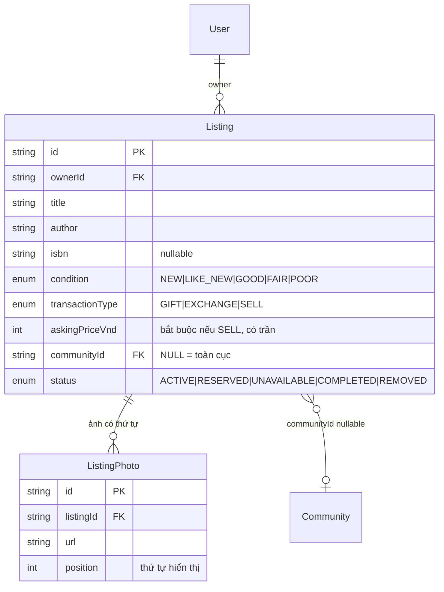

| Use case | Ghi | Quy tắc nghiệp vụ |
|---|---|---|
| Tạo listing | `Listing`, `ListingPhoto[]` | SELL → bắt buộc giá + ≤ trần; description 20–2000 ký tự |
| Sửa / ẩn | `Listing` (status→UNAVAILABLE) | chỉ owner |
| Xóa | `Listing.status`→REMOVED | owner / mod (xem #5) |
| Tra ISBN | — (gọi API ngoài, điền sẵn form) | — |

**Touch point:** `Listing.status` bị **#4 điều khiển** khi giao dịch chạy (ACTIVE→RESERVED→COMPLETED). `Listing.communityId` trỏ sang **#6** với `onDelete: SetNull` — xóa nhóm thì listing thành toàn cục, không mất.

---

## 3. Discovery (#3)

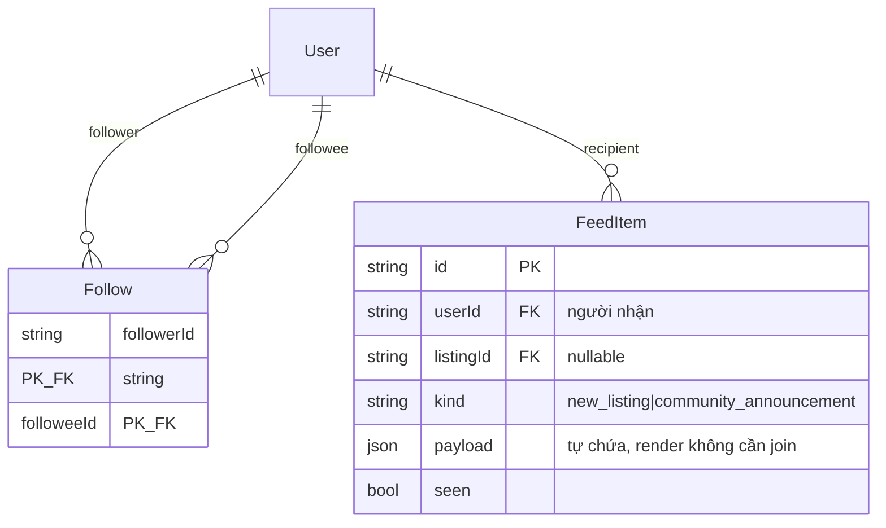

| Use case | Ghi | Đọc |
|---|---|---|
| Follow / unfollow | `Follow` ±, `User.followerCount/followingCount` ± | — |
| Feed cá nhân hóa | `FeedItem` (fan-out khi #2 đăng sách) | feed phân trang `(userId, createdAt)` |
| Tìm full-text | — | `Listing` (index `status, genre, transactionType`) |

**Touch point lớn nhất của dự án:** khi #2 đăng 1 listing, **fan-out job** (`fanout.ts`) quét follower của owner + thành viên community → ghi `FeedItem` **và** `Notification` (#6) **cùng một lượt**. Đây là chỗ 3 module (#2, #3, #6) gặp nhau — cần thống nhất ai gọi ai.

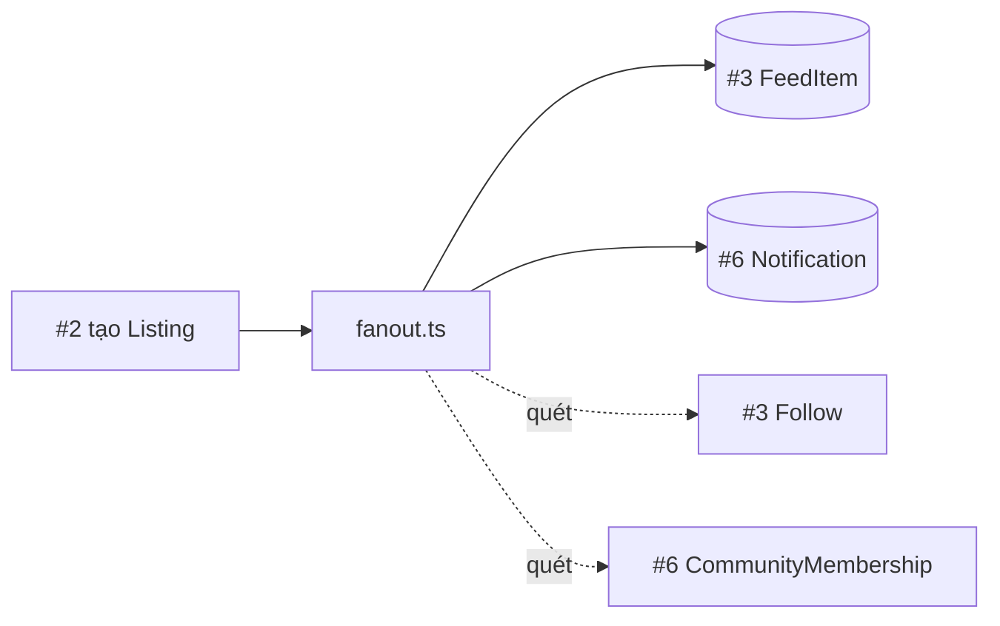

---

## 4. Transactions & Messaging (#4)

Trái tim logic của hệ thống. Người #4 sở hữu **máy trạng thái** — nơi duy nhất được phép đổi `Transaction.status` và `Listing.status`.

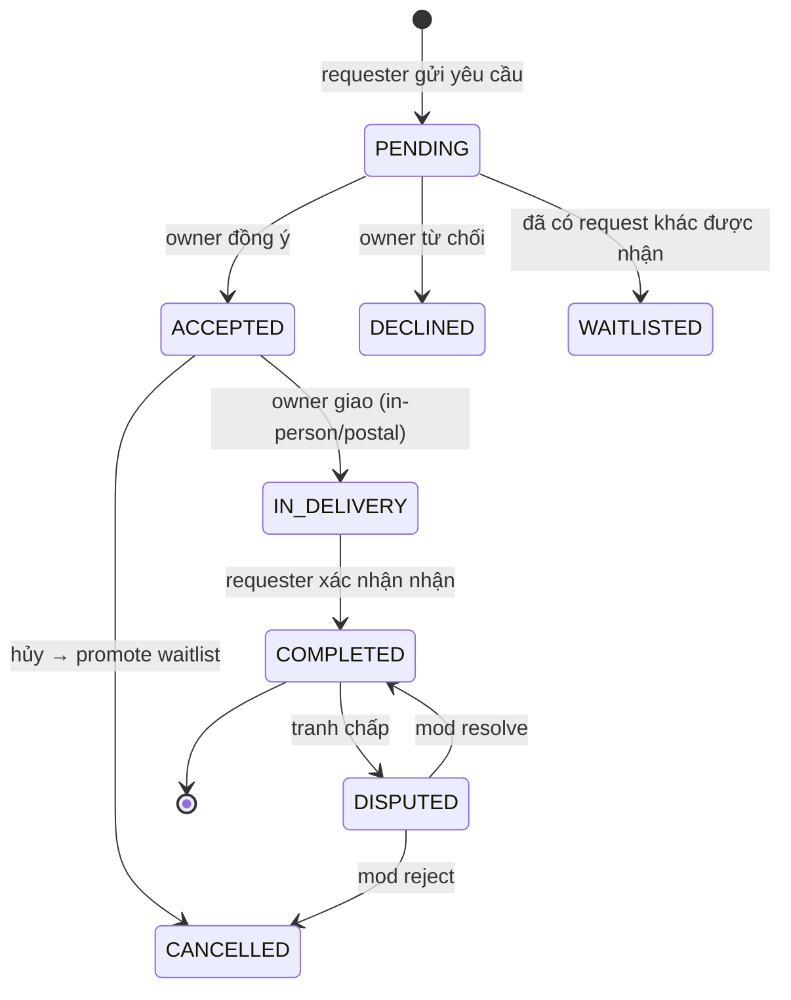

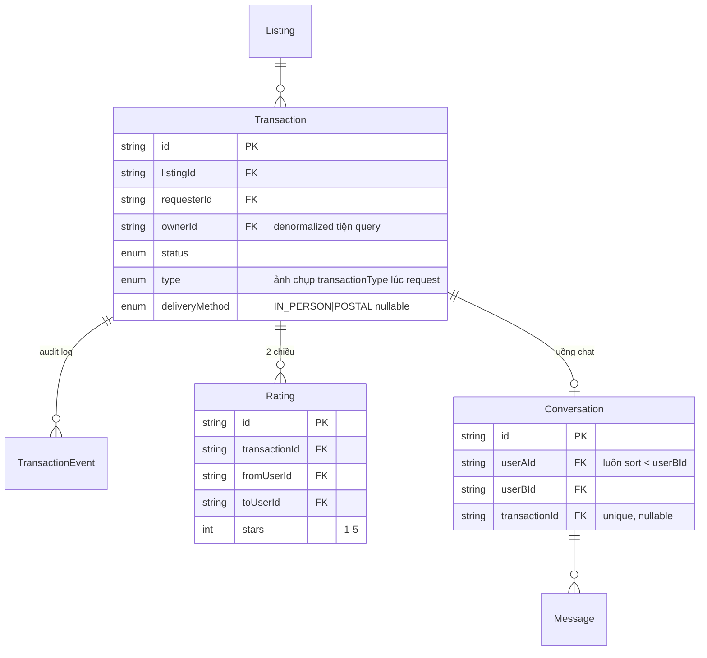

| Use case | Ghi | Side-effect (cùng transaction) |
|---|---|---|
| Gửi yêu cầu | `Transaction` (PENDING), `TransactionEvent` | → notify owner (#6) |
| Accept | status→ACCEPTED, `Listing`→RESERVED, mở `Conversation` | → notify requester |
| Complete | status→COMPLETED, `Listing`→COMPLETED | → **+10 uy tín cả 2 (#5)** + notify |
| Đánh giá | `Rating` (unique theo chiều) | → uy tín (#5) |
| Chat | `Message`, `Conversation.lastMessageAt` | → notify người nhận (#6) |

**Touch point:** mỗi lần `transition()` xong, side-effect gọi sang **#5 (reputation)** và **#6 (notification)**. Người #4 phát `DomainEvent`, không tự ghi notification/uy tín — để logic "ai nhận / cộng bao nhiêu" nằm ở chủ sở hữu module đó.

---

## 5. Trust & Safety (#5)

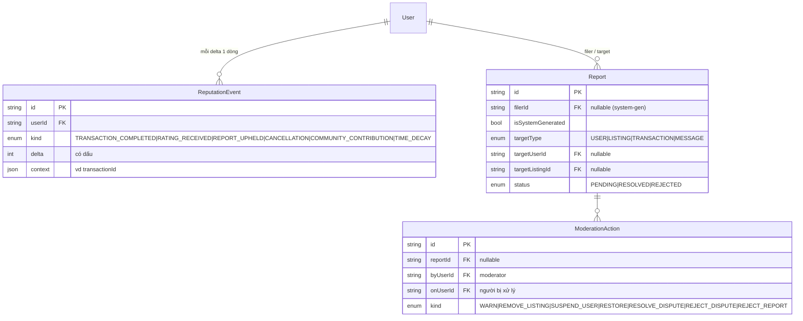

| Use case | Ghi | Hệ quả |
|---|---|---|
| Tố cáo | `Report` (PENDING) | vào hàng đợi |
| Mod xử lý | `ModerationAction`, `Report.status` | nếu upheld → `ReputationEvent` âm + notify (#6); REMOVE_LISTING → `Listing`→REMOVED (#2) |
| Engine uy tín | `ReputationEvent`, cập nhật `User.reputationScore/Tier` (#1) | nếu đổi tier → notify (#6) |

**Điểm cốt lõi:** `User.reputationScore` là **tổng** các `ReputationEvent`. Engine kẹp điểm trong `[0,100]`, đổi tier thì bắn `reputation.tier_changed`. Người #5 là **người duy nhất** được ghi `ReputationEvent` và sửa `User.reputationScore`.

---

## 6. Community & Ops (#6)

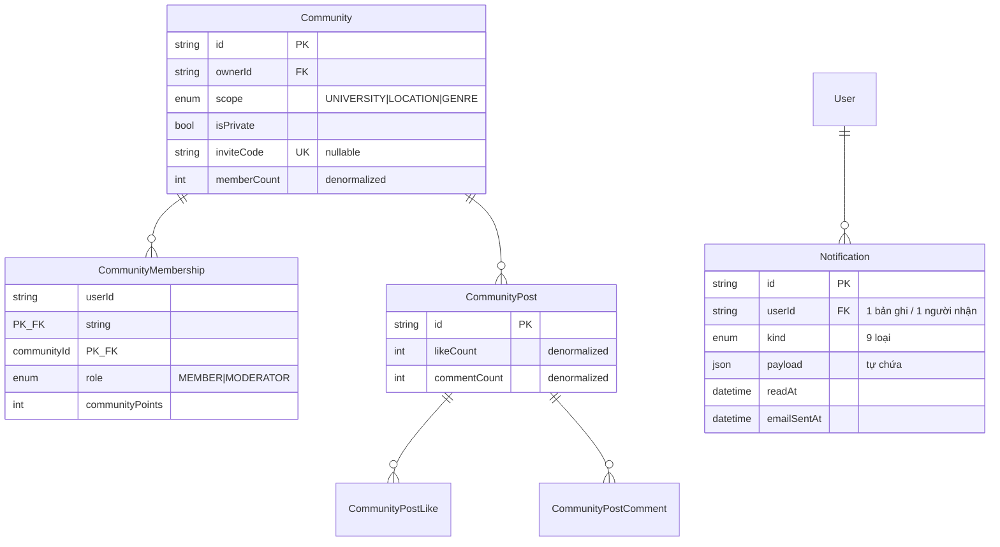

| Use case | Ghi | Đếm denormalized |
|---|---|---|
| Tạo/join/leave nhóm | `Community`, `CommunityMembership` | `memberCount` ± 1 |
| Đăng bài | `CommunityPost` | `communityPoints` +5 → notify cả nhóm |
| Like / comment | `CommunityPostLike` / `Comment` | `likeCount/commentCount` ±1, điểm ±2/+3 → notify tác giả |
| Thông báo | `Notification` (fan-out) | đọc/gửi email theo `readAt`/`emailSentAt` |

**#6 là "trạm thu gom":** notification đến từ **mọi module** (giao dịch #4, listing #2, uy tín #5, kiểm duyệt #5, community #6) đều đổ về bảng `Notification`. Chi tiết flow xem `Notifications_v2.md` và `Community_v2.md`.

---

## 7. Bản đồ điểm chạm chéo — *cẩm nang tránh dẫm chân nhau*

Bảng này là thứ cả nhóm cần dán lên tường. Cột "Chủ" = người được phép **ghi**; cột "Đọc/kích hoạt" = người phụ thuộc.

| Field / Bảng | Chủ (ghi) | Ai đọc / kích hoạt ghi | Ghi chú |
|---|---|---|---|
| `User.id` | #1 | tất cả | Bất biến — không bao giờ đổi |
| `User.reputationScore/Tier` | **#5** | #1 đọc hiển thị | #1 sở hữu bảng nhưng KHÔNG ghi field này |
| `User.followerCount/followingCount` | **#3** | #1 đọc hiển thị | tương tự trên |
| `User.status` | #1, **#5** | mọi nơi check ACTIVE | #5 set SUSPENDED qua moderation |
| `Listing.status` | #2, **#4** | #3 (feed), #5 (remove) | #4 điều khiển khi giao dịch chạy |
| `Listing.communityId` | #2 | #6 (đếm member để fan-out) | `onDelete: SetNull` |
| `Transaction` side-effects | #4 phát event | #5 (uy tín), #6 (notify) | #4 không tự ghi 2 bảng kia |
| `Notification` | **#6** | mọi module gọi `dispatchNotifications` | trạm thu gom |
| `FeedItem` | **#3** | #2/#6 kích hoạt qua fanout | |

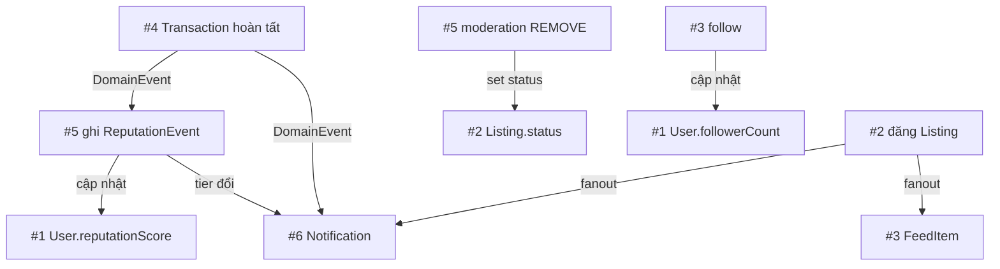

---

## 8. Tóm tắt phân công

| Người | Module | Số bảng | Độ phức tạp | Phụ thuộc chính |
|---|---|---|---|---|
| **#1** | Identity & Profile | 4 | Trung bình | Là gốc — ai cũng phụ thuộc #1 |
| **#2** | Book Catalog | 2 | Thấp–TB | Phụ thuộc #1; bị #4 sửa status |
| **#3** | Discovery | 2 | TB (fan-out) | Phụ thuộc #1, #2 |
| **#4** | Transactions & Messaging | 5 | **Cao** (state machine) | Kích hoạt #5, #6 |
| **#5** | Trust & Safety | 3 | **Cao** (uy tín engine) | Ghi vào #1; bị #4 kích hoạt |
| **#6** | Community & Ops | 6 | Cao (trạm notify) | Nhận event từ mọi module |

**3 nguyên tắc vàng cho cả nhóm:**
1. **Chỉ chủ sở hữu được ghi field của mình** — đặc biệt 4 field denormalized trên `User` (#5 và #3 ghi, không phải #1).
2. **Side-effect đi qua `DomainEvent`** — #4 không tự ghi notification/uy tín, mà phát event cho #5/#6 xử lý.
3. **Đếm denormalized sửa trong cùng transaction** với thao tác gốc (`memberCount`, `likeCount`, `commentCount`, `reputationScore`, `followerCount`) — quên = số liệu lệch vĩnh viễn.
