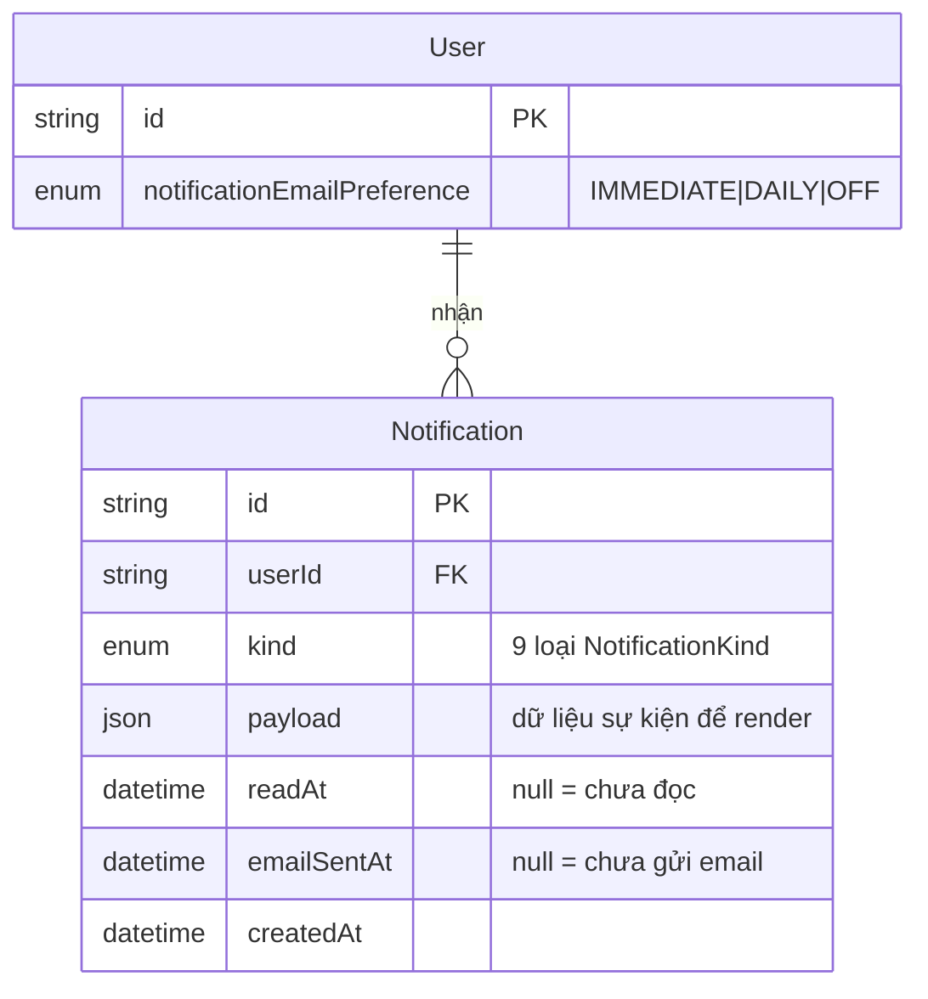
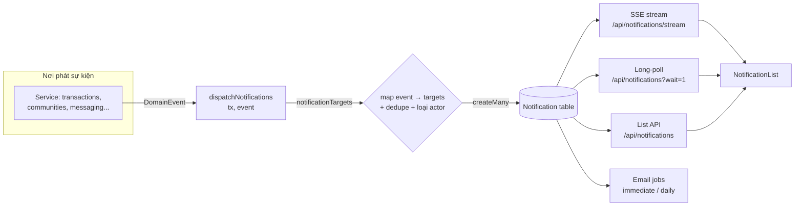
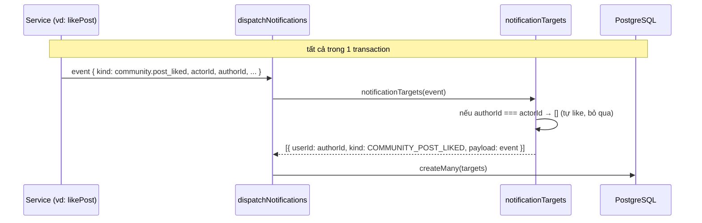
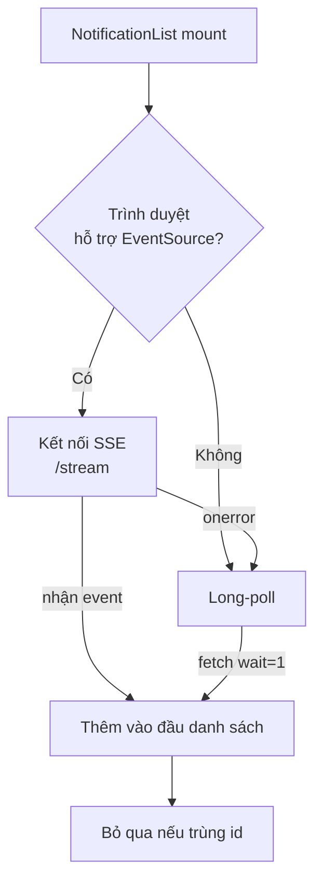
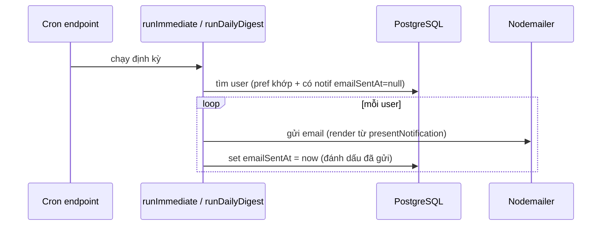

# Notifications — Tài liệu tính năng & backend

## 1. Tính năng (top-down)

Hệ thống thông báo cho người dùng biết các sự kiện liên quan tới họ: giao dịch, tin nhắn, hoạt động trong community, uy tín, kiểm duyệt. Có 3 kênh tiêu thụ: **in-app realtime**, **danh sách có phân trang**, và **email** (tùy chọn).

| Nhóm | Loại thông báo (NotificationKind) | Kích hoạt khi |
|---|---|---|
| **Giao dịch** | `TRANSACTION_STATUS_CHANGED` | Có người request sách của bạn; request được accept/decline/cancel/complete; được đẩy khỏi waitlist; nhắc giao hàng |
| **Tin nhắn** | `NEW_MESSAGE` | Nhận tin nhắn chat mới |
| **Listing** | `NEW_LISTING_FROM_FOLLOWED` | Người bạn theo dõi đăng sách mới |
| **Community** | `COMMUNITY_ANNOUNCEMENT` | Có listing mới trong nhóm bạn tham gia |
| | `COMMUNITY_POST_CREATED` | Có bài mới trong nhóm |
| | `COMMUNITY_POST_LIKED` | Bài của bạn được like |
| | `COMMUNITY_POST_COMMENTED` | Bài của bạn có bình luận mới |
| **Uy tín** | `REPUTATION_TIER_CHANGED` | Hạng uy tín của bạn thay đổi |
| **Kiểm duyệt** | `MODERATION_ACTION` | Moderator xử lý một ticket liên quan tới bạn |

**Tùy chọn email** (`NotificationEmailPreference`): `IMMEDIATE` (gửi ngay mỗi cái), `DAILY` (gộp 1 email/ngày), `OFF` (không email — vẫn nhận in-app).

## 2. Mô hình dữ liệu

**Điểm thiết kế:**
- Mỗi bản ghi `Notification` là **của riêng 1 người nhận** (fan-out: 1 sự kiện → N bản ghi cho N người).
- `payload` (JSON) lưu nguyên dữ liệu sự kiện (title, các id...) để lúc hiển thị **không cần join** lại — render thuần từ payload.
- `readAt` và `emailSentAt` là 2 trục trạng thái độc lập: đọc in-app không ảnh hưởng gửi email và ngược lại.
- 2 index: `(userId, createdAt)` cho danh sách/realtime; `(emailSentAt, createdAt)` cho job email.

## 3. Kiến trúc backend

### Lõi: DomainEvent → Notification

Mọi thông báo đi qua một đường duy nhất, đảm bảo nhất quán:

1. **Phát sự kiện**: service tạo một `DomainEvent` (union 10 loại, định nghĩa ở `events.ts`) và gọi `dispatchNotifications(tx, event)` — **trong cùng transaction** với thao tác gốc.
2. **Ánh xạ mục tiêu**: `notificationTargets(event)` (ở `dispatcher.ts`) dùng `switch` trên `event.kind` để quyết định *ai nhận, loại gì, payload ra sao*.
3. **Khử trùng + loại actor**: `uniqueTargets()` bỏ trùng `(userId, kind)` và **luôn loại người tạo sự kiện** — bạn không tự nhận thông báo về hành động của chính mình.
4. **Ghi**: `tx.notification.createMany(targets)` — một lần ghi nhiều bản.

> Vì việc bắn notification nằm **trong transaction gốc**, nếu thao tác chính rollback thì notification cũng không được tạo → không bao giờ có thông báo "ma" cho việc chưa xảy ra.

### Tầng hiển thị: presentNotification

Bản ghi DB chỉ có `kind` + `payload` thô. Hàm thuần `presentNotification(kind, payload)` (`lib/notifications/presentation.ts`) biến nó thành `{ title, body, href }` để hiển thị. **Dùng chung** cho cả in-app và email → nội dung đồng nhất mọi kênh.

### Phân phối realtime (3 cơ chế, có fallback)

- **SSE** (`sse.ts`): server giữ kết nối mở, mỗi 3 giây query các notification có `createdAt > after` rồi đẩy về. `after` dịch dần theo bản ghi mới nhất đã gửi.
- **Long-poll** (`longPollNotifications`): fallback khi SSE lỗi/không hỗ trợ — giữ request tối đa 25s, poll mỗi 2s, trả về ngay khi có dữ liệu.
- **List API** (`listNotifications`): phân trang bằng cursor cho trang xem tất cả; `unreadNotificationCount` đếm badge; `markNotificationRead` đánh dấu đã đọc.

### Kênh email (cron job, tùy chọn)

- `runImmediateNotificationEmails`: cho user `IMMEDIATE` — mỗi notif 1 email.
- `runDailyNotificationDigest`: cho user `DAILY` — gộp các notif chưa đọc/chưa gửi trong 24h thành 1 email.
- `emailSentAt` chống gửi trùng: đã gửi thì lần chạy sau bỏ qua. Bị chặn hoàn toàn nếu `EMAIL_DIGEST_ENABLED !== "true"`.

## 4. Tóm tắt nguyên tắc cốt lõi

1. **Một đường duy nhất**: mọi thông báo qua `DomainEvent → dispatchNotifications`. Thêm loại mới = thêm case trong `notificationTargets` + nhánh trong `presentNotification`.
2. **Nguyên tử**: bắn notification trong cùng transaction với hành động gốc.
3. **Không tự thông báo cho mình**: `uniqueTargets` luôn loại `actorId`.
4. **Payload tự chứa**: render không cần join — nhanh và không vỡ khi dữ liệu gốc đổi.
5. **Realtime có lưới an toàn**: SSE → long-poll → vẫn còn list API.
