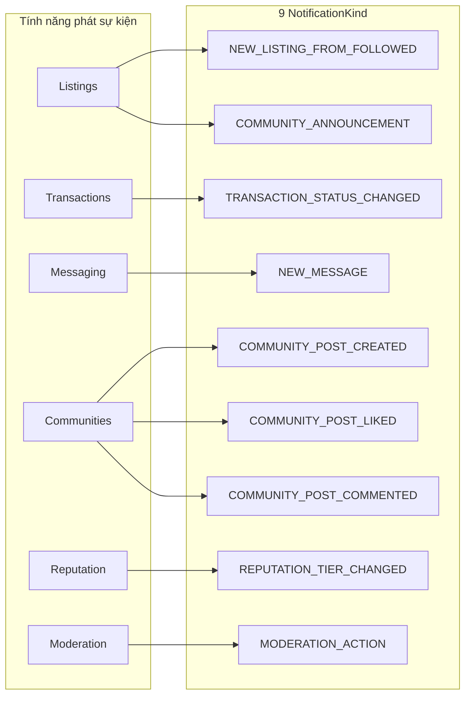
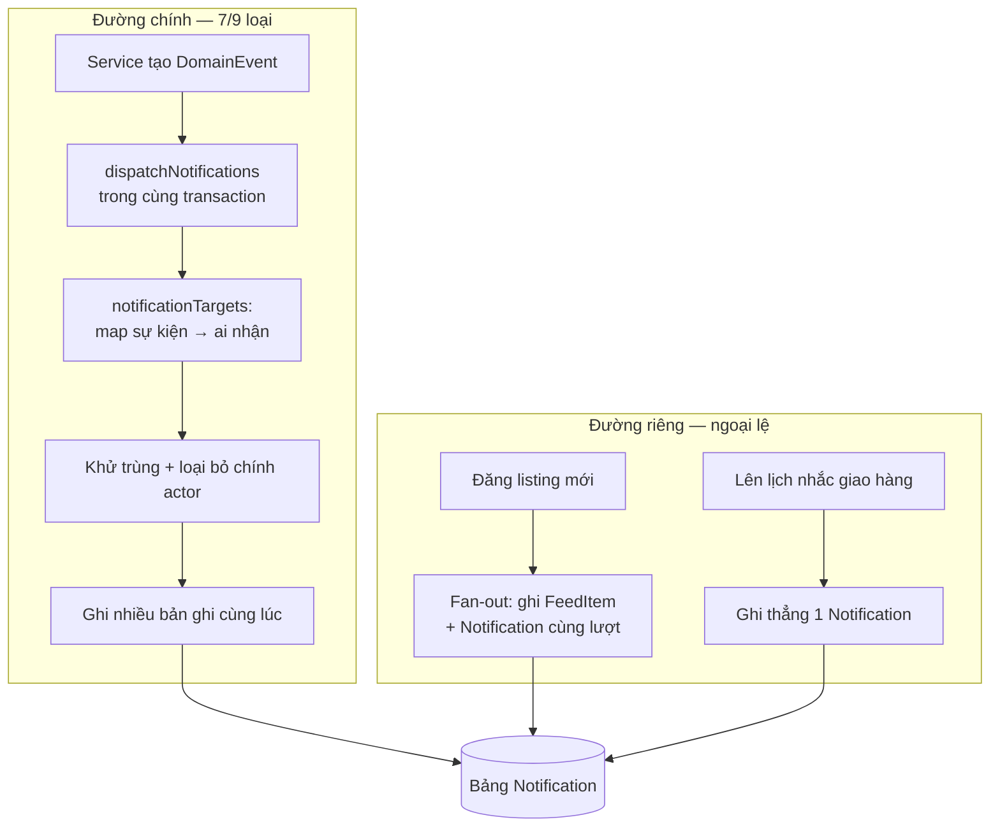
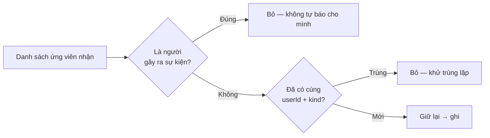
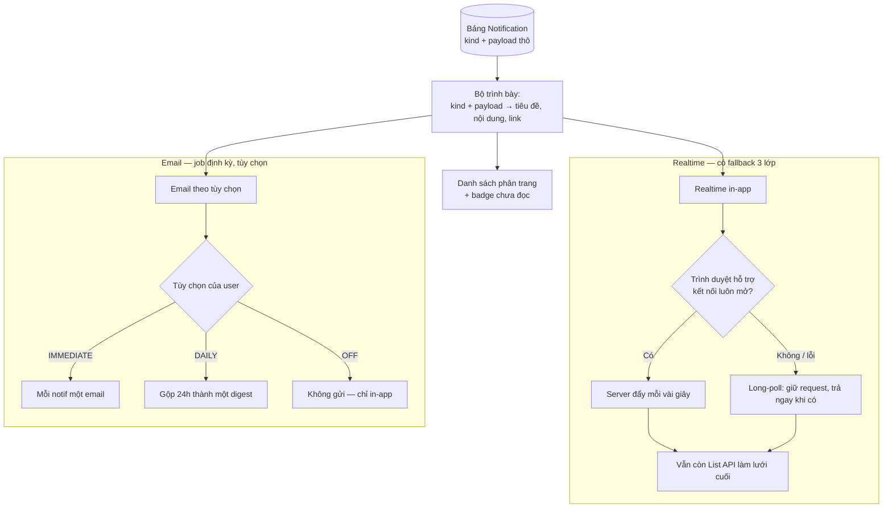
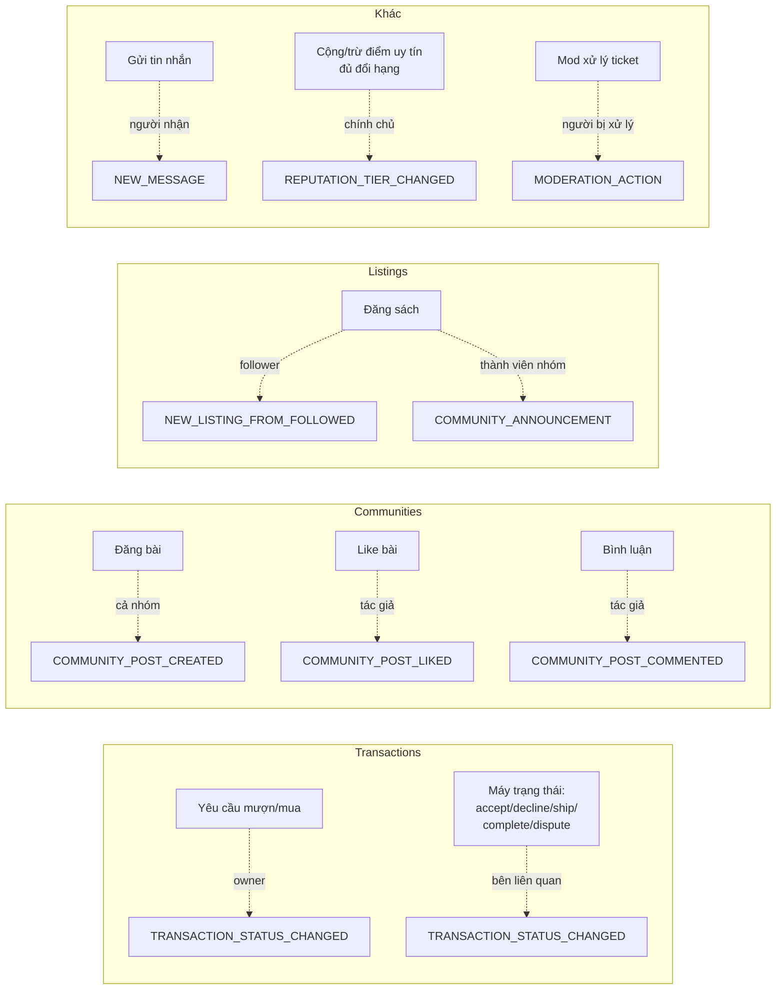

# Notifications — Bản đồ luồng (v2, high-level)

> Tài liệu này nhìn hệ thống thông báo ở góc **"sự kiện nào → ai nhận → đi qua đường nào"**, không đi vào code. Mục tiêu: hiểu mỗi notification *sinh ra từ tính năng nào*, *tương tác nào kích hoạt*, và *được hiện thực ở phần nào của hệ thống*.

---

## 1. Bức tranh tổng — 9 loại thông báo, 5 nguồn phát

Mọi thông báo trong BookBridge đều là phản ứng với một **hành động ở một tính năng khác**. Không có notification nào tự sinh ra; luôn có một "nguồn" là một service nghiệp vụ.

**Đọc bảng này như "hợp đồng" của hệ thống:**

| # | Loại thông báo | Sinh ra từ tính năng | Tương tác kích hoạt | Người nhận |
|---|---|---|---|---|
| 1 | `NEW_LISTING_FROM_FOLLOWED` | Listings | Ai đó bạn **follow** đăng sách mới | Tất cả follower của người đăng |
| 2 | `COMMUNITY_ANNOUNCEMENT` | Listings | Sách mới được đăng **gắn vào một community** | Mọi thành viên nhóm đó |
| 3 | `TRANSACTION_STATUS_CHANGED` | Transactions | Request mới / accept / decline / ship / complete / dispute / nhắc giao | Bên còn lại (owner hoặc requester) |
| 4 | `NEW_MESSAGE` | Messaging | Gửi tin nhắn chat | Người nhận tin |
| 5 | `COMMUNITY_POST_CREATED` | Communities | Đăng bài mới trong nhóm | Mọi thành viên nhóm (trừ tác giả) |
| 6 | `COMMUNITY_POST_LIKED` | Communities | Like một bài | Tác giả bài viết |
| 7 | `COMMUNITY_POST_COMMENTED` | Communities | Bình luận một bài | Tác giả bài viết |
| 8 | `REPUTATION_TIER_CHANGED` | Reputation | Điểm uy tín đổi đủ để **đổi hạng** | Chính chủ |
| 9 | `MODERATION_ACTION` | Moderation | Mod xử lý ticket (warn/remove/suspend...) | Người bị xử lý |

---

## 2. Hai con đường đi của một thông báo

Đây là điểm dễ hiểu nhầm nhất. Phần lớn notification đi qua **một cửa chung** (`dispatchNotifications`), nhưng có **hai ngoại lệ** đi đường riêng vì lý do hiệu năng.

**Vì sao có ngoại lệ?**

- **Listing mới** (`NEW_LISTING_FROM_FOLLOWED` + `COMMUNITY_ANNOUNCEMENT`): khi đăng sách, hệ thống vừa phải đẩy vào **feed** của follower/thành viên, vừa bắn **notification**. Hai việc này chia sẻ cùng một tập người nhận, nên gộp chung trong bước fan-out để không phải quét danh sách hai lần. Nó tái dùng *logic chọn người nhận* của cửa chung nhưng tự ghi.
- **Nhắc giao hàng** (`delivery_reminder_scheduled`): đây là notification *đặt lịch trước* cho một thời điểm tương lai, không phải phản ứng tức thời với một sự kiện — nên nó được ghi thẳng thay vì qua bộ map sự kiện.

> Quy tắc ngầm: **mọi notification được ghi trong cùng transaction với hành động gốc.** Nếu hành động chính (đăng bài, gửi tin, đổi trạng thái giao dịch) bị rollback thì notification cũng biến mất — không bao giờ có thông báo "ma" cho việc chưa thực sự xảy ra.

---

## 3. Hai nguyên tắc lọc người nhận

Trước khi ghi, bộ map luôn áp 2 luật. Đây là lý do bạn không bao giờ nhận thông báo vô nghĩa:

1. **Không tự thông báo cho mình** — tự like bài mình, tự đăng listing... đều không sinh notification cho chính actor.
2. **Khử trùng `(userId, kind)`** — nếu một người vừa là follower vừa là thành viên nhóm khi bạn đăng listing, họ không nhận hai thông báo trùng loại.

---

## 4. Vòng đời sau khi ghi — từ DB tới mắt người dùng

Một bản ghi notification chỉ lưu `kind` + `payload` thô. Nó được "dịch" thành nội dung hiển thị ngay lúc render, và phân phối qua nhiều kênh có lưới an toàn.

**Điểm thiết kế cần nhớ:**

- **`payload` tự chứa**: nội dung hiển thị render thuần từ payload, không join lại bảng gốc → nhanh, và không vỡ nếu dữ liệu gốc (bài viết, listing) sau đó bị sửa/xóa.
- **Một bộ trình bày dùng chung** cho cả in-app lẫn email → nội dung đồng nhất mọi kênh. Thêm loại notification mới = thêm một nhánh ở bộ map người nhận + một nhánh ở bộ trình bày.
- **`readAt` và `emailSentAt` độc lập**: đọc in-app không ảnh hưởng việc gửi email, và `emailSentAt` chống gửi email trùng.

---

## 5. Lần theo từng nguồn — sự kiện đi qua đâu

Sơ đồ "ai gọi ai" để thấy notification luôn là **tác dụng phụ** của một service nghiệp vụ, không phải một tính năng đứng riêng:

**Lưu ý về `COMMUNITY_ANNOUNCEMENT`:** loại này *được sinh ra từ tính năng Listings* (khi sách mới gắn vào nhóm), **không phải** từ việc đăng bài. Đăng bài dùng `COMMUNITY_POST_CREATED`. Đây là chỗ tên gọi dễ gây nhầm: "announcement" ở đây nghĩa là "có sách mới trong nhóm", còn "post_created" mới là bài thảo luận.

> Một điểm sạch của kiến trúc: trạng thái giao dịch không tự gọi notification rải rác. **Máy trạng thái** quyết định mỗi bước chuyển sinh ra "tác dụng phụ" gì (đổi trạng thái listing, cộng điểm uy tín, *và* bắn notify cho ai). Notification chỉ là một trong các tác dụng phụ đó → muốn biết giao dịch báo cho ai, chỉ cần đọc bảng chuyển trạng thái.

---

## 6. Tóm tắt nguyên tắc cốt lõi

1. **Notification là tác dụng phụ, không phải tính năng độc lập** — luôn truy ngược được về một hành động ở Listings / Transactions / Messaging / Communities / Reputation / Moderation.
2. **Một cửa chung cho phần lớn** (`dispatchNotifications`), **hai ngoại lệ có chủ đích** (fan-out listing, nhắc giao hàng đặt lịch).
3. **Nguyên tử** — ghi cùng transaction với hành động gốc; rollback thì mất theo.
4. **Không tự báo cho mình + khử trùng** — hai luật lọc người nhận.
5. **Payload tự chứa, một bộ trình bày dùng chung** — render nhanh, đồng nhất in-app và email.
6. **Realtime có lưới an toàn 3 lớp** — kết nối mở → long-poll → list API.
