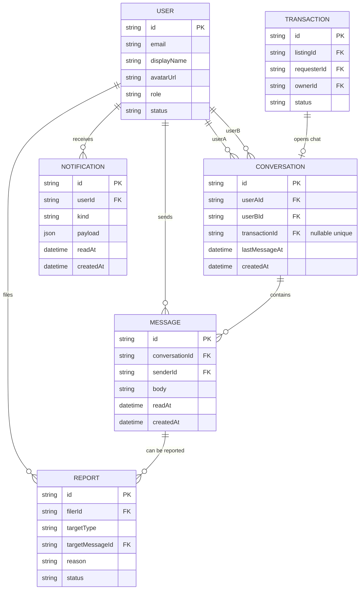
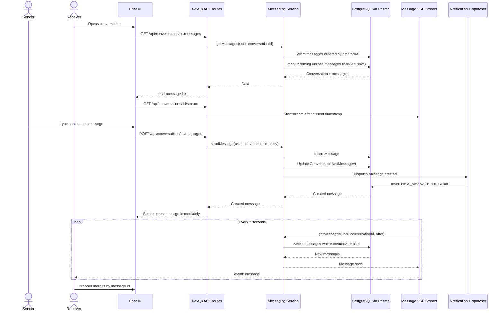
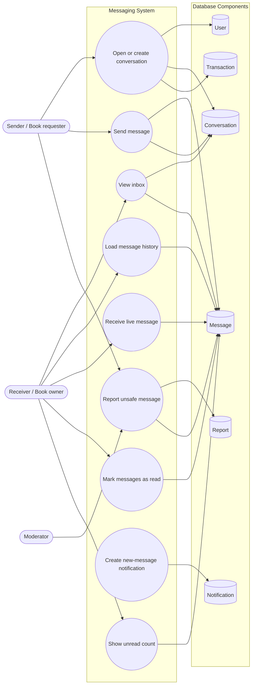

# Messages And Artifacts: Codebase And Database Guide

This document explains the parts of BookBridge related to direct messages and interactive artifacts. It is written for a presentation: start with the user story, then explain the code path, then explain the database.

## 1. Position In The Codebase

BookBridge uses a Next.js App Router structure:

```text
src/app/                 Page routes and API routes
src/components/          Client-side UI components
src/server/              Domain services and business rules
src/lib/                 Shared labels, artifact metadata, and helpers
prisma/schema.prisma     Database schema
```

The important rule is separation of concerns:

- Pages render screens and call server functions.
- API routes validate requests and call services.
- Server services contain business logic and Prisma queries.
- Prisma models define the persistent data relationships.

For messages and artifacts, the relevant modules are:

```text
src/app/messages/page.tsx
src/app/messages/[conversationId]/page.tsx
src/components/messaging/ChatThread.tsx
src/components/messaging/LiveMessagePanel.tsx
src/components/messaging/DirectMessageButton.tsx
src/app/api/conversations/route.ts
src/app/api/conversations/[id]/messages/route.ts
src/app/api/conversations/[id]/stream/route.ts
src/server/messaging/service.ts
src/server/messaging/sse.ts

src/app/artifacts/page.tsx
src/app/artifacts/the-alchemist/page.tsx
src/app/artifacts/tuc-nuoc-vo-bo/page.tsx
src/components/artifacts/ArtifactGame.tsx
src/components/artifacts/ArtifactDiscussion.tsx
src/server/artifacts/comments.ts
src/lib/artifacts/registry.ts
src/lib/artifacts/*-story.ts
src/lib/artifacts/*-audio.ts
```

## 2. Messaging Feature

### User Flow

The messaging feature exists to support safe book exchanges:

1. A user finds a listing or seller.
2. The user clicks a message button.
3. The backend creates or reuses a direct conversation.
4. Both users can read and send messages.
5. The UI updates live using Server-Sent Events.
6. Unread messages appear in the navigation message panel.
7. Suspicious messages can be reported to moderation.

### Main UI Components

`DirectMessageButton` is the entry point from seller/listing contexts. If the user is not signed in, it sends them to login. If signed in, it calls `POST /api/conversations` and routes to the conversation page.

`ChatThread` is the full conversation page. It:

- loads existing messages,
- opens an `EventSource` stream for live messages,
- falls back to polling every 2.5 seconds,
- merges incoming messages by id to avoid duplicates,
- scrolls to the latest message,
- lets recipients report messages.

`LiveMessagePanel` is the compact navigation panel. It:

- shows unread counts,
- lists conversations,
- opens an inline chat view,
- moves updated conversations to the top,
- uses the same API and SSE stream as the full page.

### Backend Flow

The API routes are deliberately thin:

```text
GET  /api/conversations
  -> listConversations(user.id)

POST /api/conversations
  -> createDirectConversation(user, otherUserId)

GET  /api/conversations/[id]/messages
  -> getMessages(user, conversationId, after?)

POST /api/conversations/[id]/messages
  -> sendMessage(user, conversationId, body)

GET  /api/conversations/[id]/stream
  -> messageStream(user, conversationId, request.signal)
```

The service layer enforces the important rules:

- A user cannot message themself.
- The other user must exist and be active.
- A direct conversation is unique for the same two users.
- Only participants, moderators, and admins can read a conversation.
- Message body is validated with Zod: non-empty, max 2000 characters.
- Sending a message updates `Conversation.lastMessageAt`.
- Sending a message dispatches a notification event.

### Real-Time Design

Messaging uses Server-Sent Events instead of WebSockets. This fits the feature because the server only needs to push new messages to the browser; replies still use normal `POST` requests.

The stream behavior:

- emits `retry: 3000` so the browser reconnects,
- sends keep-alive comments every 15 seconds,
- polls the database every 2 seconds for messages after the last seen timestamp,
- emits each new message as an SSE `message` event,
- closes cleanly when the browser disconnects.

This is simpler than WebSockets and works well for a course-scale application.

## 3. Messaging Database And Dynamic Loading

The message system is not only two tables. It touches six database areas:

```text
User
Conversation
Message
Transaction
Notification
Report
```

The core tables are `Conversation` and `Message`, but the surrounding tables explain why messages work inside the BookBridge transaction and trust system.

### Database Components

| Component | Why It Matters For Messages |
|---|---|
| `User` | Every conversation has two users: `userA` and `userB`. Every message has one sender. |
| `Conversation` | The inbox-level object. It connects two users and optionally connects to a transaction. |
| `Message` | The actual chat content. Stores body, sender, read state, and creation time. |
| `Transaction` | Optional context for an exchange-related conversation. A transaction can have one conversation. |
| `Notification` | Stores unread/new-message awareness for the recipient. |
| `Report` | Lets users report unsafe message content to moderation. |

### Mermaid ER Diagram



### `Conversation`

```prisma
model Conversation {
  id            String       @id @default(cuid())
  userAId       String
  userBId       String
  transactionId String?      @unique
  lastMessageAt DateTime?
  createdAt     DateTime     @default(now())
  messages      Message[]

  @@unique([userAId, userBId, transactionId])
  @@index([userAId])
  @@index([userBId])
}
```

Purpose:

- Stores a chat between two users.
- Can optionally be tied to a transaction.
- Keeps `lastMessageAt` for inbox sorting.
- Uses `userAId` and `userBId` so conversations can be found from either participant.

Important design choice:

Direct conversations sort the two user ids before creation. This prevents duplicate direct chats such as `A -> B` and `B -> A`.

Database behavior:

- `@@unique([userAId, userBId, transactionId])` prevents duplicate conversation rows for the same pair and transaction.
- `transactionId String? @unique` means a transaction can have at most one conversation.
- `@@index([userAId])` and `@@index([userBId])` make inbox lookup fast.
- `lastMessageAt` avoids scanning all messages just to sort the inbox.

### `Message`

```prisma
model Message {
  id             String       @id @default(cuid())
  conversationId String
  senderId       String
  body           String
  readAt         DateTime?
  createdAt      DateTime     @default(now())

  @@index([conversationId, createdAt])
}
```

Purpose:

- Stores individual message bodies.
- Tracks sender and conversation.
- Supports read state with `readAt`.
- Supports efficient chronological loading by `(conversationId, createdAt)`.

Database behavior:

- `conversationId` links every message to one conversation.
- `senderId` links every message to one user.
- `readAt` is `null` until the other participant loads the conversation.
- `createdAt` controls chronological display and incremental loading.
- `@@index([conversationId, createdAt])` is the key dynamic-loading index.

### `User`

Messages depend on `User` in three places:

```prisma
conversationsA Conversation[] @relation("ConversationUserA")
conversationsB Conversation[] @relation("ConversationUserB")
messages       Message[]
```

How it is used:

- The inbox query finds conversations where `userAId = currentUser.id` or `userBId = currentUser.id`.
- The UI calculates the "other user" by comparing the current user id against `userAId`.
- Message rows include sender display name so the UI can label bubbles.
- Access control checks that the current user is one of the participants.

### `Transaction`

Transactions are optional but important because BookBridge messages often happen after a book request.

```prisma
conversation Conversation?
```

How it is used:

- A transaction can open a conversation between requester and owner.
- `Conversation.transactionId` gives chat context such as listing title and transaction status.
- The inbox can display either `Direct conversation` or the related listing/status.

### `Notification`

New messages create notification records for recipients.

```prisma
enum NotificationKind {
  NEW_MESSAGE
}

model Notification {
  id        String
  userId    String
  kind      NotificationKind
  payload   Json
  readAt    DateTime?
  createdAt DateTime
}
```

How it is used:

- `sendMessage()` dispatches a `message.created` event.
- The notification dispatcher creates a `NEW_MESSAGE` notification for the recipient.
- The navigation bell and notification list can show the new message as platform activity.

### `Report`

Messages connect to moderation through `Report.targetMessageId`.

```prisma
enum ReportTargetType {
  MESSAGE
}

model Report {
  targetType      ReportTargetType
  targetMessageId String?
  targetMessage   Message?
  reason          String
  status          ReportStatus
}
```

How it is used:

- The receiving user can report an unsafe message from `ChatThread`.
- Moderators see the report in the moderation queue.
- This keeps private messaging connected to trust and safety.

### Dynamic Loading: What Happens In The Database

Dynamic loading is powered by three fields:

```text
Conversation.lastMessageAt
Message.createdAt
Message.readAt
```

They each solve a separate UI problem:

| Field | UI Problem Solved |
|---|---|
| `Conversation.lastMessageAt` | Sort inbox by most recently active conversation. |
| `Message.createdAt` | Load messages in chronological order and ask for only newer messages. |
| `Message.readAt` | Count unread incoming messages and clear unread state when opened. |

### Inbox Query

The inbox query comes from `listConversations(userId)`.

Conceptually:

```sql
SELECT conversations
WHERE userAId = currentUser OR userBId = currentUser
INCLUDE other user, transaction summary, last message, unread count
ORDER BY lastMessageAt DESC NULLS LAST, createdAt DESC;
```

Why this works:

- `userAId` and `userBId` indexes make participant lookup fast.
- `lastMessageAt` makes sorting cheap.
- The last message preview is loaded with `take: 1` ordered by `createdAt desc`.
- Unread count is computed by counting messages from the other user where `readAt IS NULL`.

### Message Page Initial Load

The full chat page calls:

```text
GET /api/conversations/[id]/messages
```

Service behavior:

```text
1. Check that the current user is a participant.
2. Load up to 100 messages ordered by createdAt ascending.
3. Mark unread incoming messages as read.
4. Return conversation metadata and messages.
```

Database shape:

```sql
SELECT *
FROM Message
WHERE conversationId = :conversationId
ORDER BY createdAt ASC
LIMIT 100;

UPDATE Message
SET readAt = now()
WHERE conversationId = :conversationId
  AND senderId != :currentUserId
  AND readAt IS NULL;
```

### SSE Dynamic Loading

The live stream route is:

```text
GET /api/conversations/[id]/stream
```

The stream starts with `after = new Date()`. Every 2 seconds it asks:

```text
getMessages(user, conversationId, after)
```

That becomes:

```sql
SELECT *
FROM Message
WHERE conversationId = :conversationId
  AND createdAt > :after
ORDER BY createdAt ASC
LIMIT 100;
```

Then each returned message is sent to the browser:

```text
event: message
data: { message json }
```

The browser merges messages by `id`, which prevents duplicates if the SSE stream and fallback polling return the same row.

### Sending A Message

Sending a message uses a database transaction:

```text
1. Insert Message.
2. Update Conversation.lastMessageAt.
3. Dispatch NEW_MESSAGE notification.
```

Conceptually:

```sql
INSERT INTO Message (conversationId, senderId, body, createdAt)
VALUES (:conversationId, :senderId, :body, now());

UPDATE Conversation
SET lastMessageAt = :messageCreatedAt
WHERE id = :conversationId;
```

Why this matters:

- The new message appears in the thread.
- The conversation jumps to the top of the inbox.
- The recipient gets unread count and notification updates.

### Mermaid Sequence Diagram: Dynamic Message Loading



### Mermaid Use Case Diagram

Mermaid does not have a dedicated UML use-case syntax in every renderer, so this is drawn as a use-case flowchart.



### Short Presenter Script For The Database

The messaging database is centered on `Conversation` and `Message`, but it also connects to `User`, `Transaction`, `Notification`, and `Report`. `Conversation` is the inbox object, `Message` is the actual chat content, `Notification` gives the recipient awareness, and `Report` connects unsafe messages to moderation. Dynamic loading works because every message has `createdAt`, every conversation has `lastMessageAt`, and unread incoming messages keep `readAt = null` until the receiver opens the thread.

## 4. Artifacts Feature

### User Flow

Artifacts are interactive literary experiences. A user can:

1. Open `/artifacts`.
2. Choose an artifact such as `The Alchemist` or `Tuc Nuoc Vo Bo`.
3. Play through an interactive story scene.
4. Listen to story audio.
5. Make choices through hotspots.
6. Reach game-over or victory states.
7. Join the discussion below the artifact.

### Artifact Registry And Story Content

Artifact pages are data-driven. The registry contains metadata used by the artifact landing page:

```text
src/lib/artifacts/registry.ts
```

Story content and audio are separated by artifact:

```text
src/lib/artifacts/alchemist-story.ts
src/lib/artifacts/alchemist-audio.ts
src/lib/artifacts/tat-den-story.ts
src/lib/artifacts/tat-den-audio.ts
```

This means a new artifact can be added by creating story/audio data and a page that passes it into `ArtifactGame`.

### Main UI Components

`ArtifactGame` is the interactive engine. It receives:

- `storyNodes`,
- `initialNodeId`,
- `accentColor`,
- optional audio,
- optional listing search title.

It maintains game state:

- current story node,
- health,
- playing/game-over/victory status,
- choice history,
- flavor text.

Important UX behavior:

- narration uses a typewriter-style reveal,
- hotspots are disabled until narration finishes,
- scene changes animate with `framer-motion`,
- game-over and victory states have separate screens,
- fullscreen mode is available,
- audio follows the current node.

`ArtifactDiscussion` is the community layer below the game. It:

- loads comments for the artifact,
- supports sorting by newest or most liked,
- lets signed-in users post comments,
- lets users like comments,
- lets authors or moderators delete comments.

## 5. Artifact Database

Artifacts themselves are not stored as database rows. The artifact definitions are code/data files in `src/lib/artifacts`. The database stores community interaction around them.

### ArtifactComment

```prisma
model ArtifactComment {
  id           String   @id @default(cuid())
  artifactSlug String
  authorId     String
  body         String
  likeCount    Int      @default(0)
  createdAt    DateTime @default(now())
  updatedAt    DateTime @updatedAt

  @@index([artifactSlug, createdAt])
  @@index([artifactSlug, likeCount, createdAt])
  @@index([authorId])
}
```

Purpose:

- Stores reader discussion for a specific artifact slug.
- Keeps `likeCount` denormalized for fast sorting.
- Uses indexes for newest and most-liked views.

Important design choice:

The comment belongs to an `artifactSlug`, not an `Artifact` table. That keeps the database lightweight because artifact content is static and versioned in code.

### ArtifactCommentLike

```prisma
model ArtifactCommentLike {
  userId    String
  commentId String
  createdAt DateTime @default(now())

  @@id([userId, commentId])
  @@index([commentId])
}
```

Purpose:

- Prevents a user from liking the same comment multiple times.
- Supports toggling likes on and off.
- Updates `ArtifactComment.likeCount` transactionally.

### Validation Rules

Artifact comments use Zod validation:

```text
body: min 2 characters, max 1200 characters
```

The server also validates allowed artifact slugs:

```text
the-alchemist
tuc-nuoc-vo-bo
```

This prevents arbitrary slug injection and keeps discussion tied to known artifacts.

## 6. How To Present The Architecture

Use this order:

1. "Messages and artifacts look different in the UI, but both follow the same architecture."
2. "Pages render the experience; client components handle interaction; API routes validate; services own business logic; Prisma persists state."
3. "Messages are transactional and real-time, so they use conversations, message rows, unread counts, and SSE."
4. "Artifacts are content-driven and interactive, so the story is code/data, while discussion is stored in the database."
5. "Both features connect back to trust: messages can be reported, artifact comments can be moderated."

## 7. Short Presenter Script

My responsibility is the communication and artifact experience. For messages, I implemented the conversation model, message sending, live updates, unread indicators, and reporting connection. The database stores conversations and messages with indexes for inbox lookup and chronological loading. For artifacts, the story content is stored as code-driven nodes, while user discussion is stored in artifact comment tables. This keeps the interactive experience flexible while still preserving community engagement in the database.

The key technical decision is that both features are not isolated UI widgets. They are connected to the larger BookBridge system: authentication, notifications, moderation, users, transactions, and reputation all interact with them.
